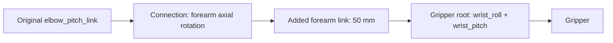

# Mini3 carrying with two seven-joint arms

This version shortens both added forearm links to **50 mm**, retaining root rotation about the forearm X axis and distal wrist roll/pitch. The root interface remains named `elbow_yaw_joint`, and the connection stays straight during rotation. `mini3_pick_carry_7dof.py` uses the existing Sonic 5200 policy for body control and seven-joint pose IK for the right arm. The default window now uses **mujoco_viewer**. Two full tests, headless and in an actual `mujoco_viewer` window, both complete grasping, loaded walking, and basket placement in **32.86 s of simulation time**, with identical recorded values and **0.5 m** tables.

## Running

The current environment has `mujoco-python-viewer==0.1.4` installed and opens a `mujoco_viewer.MujocoViewer` window. Activate the existing MuJoCo environment from the repository root, then press **P** after the window opens:

```bash
source active-adaptation/venv/mjlab/.venv/bin/activate
python mini3_pick_carry_7dof.py --start-paused
```

The XML is loaded at startup. After changing link length, close any existing window and rerun the command to load the 50 mm model.

To reinstall the same window dependency into this environment, run from the repository root:

```bash
UV_CACHE_DIR=.cache/uv .cache/uv-tool/bin/uv pip install \
  --python active-adaptation/venv/mjlab/.venv/bin/python \
  mujoco-python-viewer==0.1.4
```

Run without a viewer:

```bash
python mini3_pick_carry_7dof.py --headless --duration 60 \
  --output outputs/mini3_pick_carry_7dof
```

The default scene is `any4hdmi/assets/robots/mini3_mjlab/scene_pick_carry_7dof.xml`, and the reference remains `Neutral_walk_forward_005__A057.npz`. Initial forward separation from the blue cube is 3 m. Both tabletops are 0.5 m high; the three cubes and basket sit to the right of the walking path. The intended sequence is approach, grasp, lift, loaded walking, and basket release.

The shorter links complete the headless task with 0.5 m tables, so that height is retained. Other tasks needing lower surfaces can use `--table-height` in the generation command below, followed by new grasping and link-clearance validation at that height.

The original options and shortcuts remain available: **P** pause, **F** camera following, **F8** overview, **F9** head RGB, **F10 / F11** left / right gripper RGB, and **Esc** exit. `--camera head_rgb` selects the starting view; `--policy` selects an ONNX export with its matching YAML; `--motion` selects a reference clip. `--headless` cannot be combined with `--start-paused`.

Drag with the left button to rotate, the right button to pan, or the middle button to zoom; the scroll wheel also zooms. Hold **Shift** to switch rotation/pan directions. Right-button panning or double-click focusing disables following; press **F** to restore it. The mouse adapter fixes crashes caused by incompatible camera calls and double-click selection between `mujoco_viewer 0.1.4` and the current MuJoCo 3.11 environment. Restart the script to load the fix.

## Separate models and joint interfaces

| File | Purpose |
| --- | --- |
| `mini3_gripper_7dof.xml` | New robot with two seven-joint arms; `nq=38, nv=37, nu=29` |
| `scene_pick_carry_7dof.xml` | New tabletop carrying scene; `nq=59, nv=55, nu=29` |
| `mini3_gripper.xml`, `scene_pick_carry.xml` | Preserved original gripper model and scene |

All XML files are under `any4hdmi/assets/robots/mini3_mjlab/`. In the names below, `{side}` is `left` or `right`. Axes are defined in the corresponding link's local coordinates; the forearm extension follows local +X.

Both arms use this joint arrangement along the added link:



`elbow_yaw` sits at the connection between `elbow_pitch_link` and the added link and rotates about the model's local **longitudinal X axis**. Changing this joint angle keeps the extension's long axis aligned with the original forearm and leaves the wrist pivot position fixed in the original forearm frame, preventing bending at the connection. Both wrist axes share a pivot at the gripper root on the other end of the extension, **50 mm** from the root rotation pivot. Wrist rotation changes the gripper orientation relative to the extension.

The comparison below shows the new model's right forearm at root rotation angles of **−90°, 0°, and +90°**, with upstream joints held at the same pose and both wrist angles fixed at 0. The orange arrow marks the original forearm's longitudinal direction: the extension stays straight while the gripper rotates around that direction. This is a static MuJoCo kinematic rendering, without policy inference or physics stepping.


| Added joint | Location and axis | Range |
| --- | --- | --- |
| `{side}_elbow_yaw_joint` | Original forearm tip / root of the 50 mm extension; longitudinal local X | ±π/2 |
| `{side}_wrist_roll_joint` | End of the 50 mm extension / palm root; local X | ±π |
| `{side}_wrist_pitch_joint` | Same palm-root location as wrist_roll; local Y | ±π/2 |

Both wrist joints occupy the existing palm body, rotate in roll-then-pitch order, and use its existing mass and inertia. Actuator names append `_ctrl` to the joint name. The original 21 actuators and two gripper actuators retain their order, followed by the six added torque motors. Controllers and keyframes map by name; the new model's `qpos[7:]` is not the policy's original 21-dimensional joint vector.

Each new axis copies the corresponding `elbow_pitch` physics: `armature=0.0019 kg·m²`, `damping=0.1 N·m·s/rad`, `frictionloss=0.7 N·m`, and actuator limits of **±12.5 N·m**. No motor housings are added. The 50 mm links preserve the original 100 mm capsule's material density and 11 mm radius. Scaling the complete cylinder-plus-hemispheres volume reduces each link from 60 g to **33.837 g**; center of mass and rotational inertia are recomputed from the new geometry. The palm and two fingers still total 140 g, giving **173.837 g** of added mass per arm and a total robot mass of **12.9042547186 kg**. Head and gripper RGB cameras remain massless virtual sensors; the palm camera moves with the shortened gripper assembly.

Regenerate the new robot and scene:

```bash
python any4hdmi/scripts/generate_mini3_gripper.py --articulated-arms --extension-length 0.05
python any4hdmi/scripts/generate_mini3_pick_scene.py \
  --robot-xml any4hdmi/assets/robots/mini3_mjlab/mini3_gripper_7dof.xml \
  --output any4hdmi/assets/robots/mini3_mjlab/scene_pick_carry_7dof.xml \
  --start-distance 2.72 --surface table --table-height 0.5 \
  --cube-layout longitudinal --basket-x 1.3 --basket-y -0.3
```

The `extension_length` / `--extension-length` parameter uses metres. Seven-joint arms default to 0.05; the original non-articulated version still defaults to 0.1. The original `mini3_gripper.xml` and scene files are preserved.

## Motors and manipulation control

The policy is not retrained and retains its original 21-dimensional joint contract. IK targets for the original four right-arm joints update the original policy's joint references and are combined with its execution targets. An independent controller drives the three added right-arm joints. Initial walking stow targets, in yaw/roll/pitch order, are `[0, 0.6, 0.4] rad` on the left and `[0, -0.6, 0.4] rad` on the right. Initial `qpos` for these added joints is assigned only at reset. During manipulation, the right added axes follow IK, while the left keeps its stow targets and open gripper. The original 21-dimensional walking reference and network input/output dimensions are unchanged.

Added motors explicitly use the original elbow's **4310P** current-loop response, delay, TN speed–torque limits, and KT output mapping, rather than instantaneous ideal torque. Their smaller load inertia calls for separate position-loop settings while retaining the same motor physics: the six added axes use **kp=20, kd=0.4**, and the four original right-arm joints use **kp=30, kd=0.8**. Gravity/bias-torque feedforward, bounded integration, 1.5 rad/s IK-reference slew limits, and joint-target clipping remain active.

Seven-joint IK optimizes finger-pad center position and palm orientation, adding a collision-distance penalty when physical geometry clearance falls below **4 mm**. The short-link grasp keeps the palm horizontal with a target yaw of **−0.5 rad (about −28.6°)**, approaching the cube diagonally in the horizontal plane. The grasp center is 15 mm along the existing TCP's local −X axis, with the final approach target **2 mm above** the actual cube center.

For this task, IK uses operating ranges of `[-1.4, 0.15] rad` for right shoulder roll and `[-1.5, 1.5] rad` for right wrist roll, with right shoulder pitch at least `-2 rad` and right elbow pitch at most `2.4 rad`. These bounds avoid switching to a redundant elbow-flipped solution while clearing obstacles, raising, and lowering the hand. They only constrain solution selection for this task; full physical joint ranges remain unchanged in the XML, including the root rotation's complete **±π/2** range.

IK computes on separate data. The short-link preferred seed is `[-0.1, -0.3, -0.3, 0.45, 0, 0.2, -0.25] rad`, ordered as shoulder pitch/roll/yaw, original elbow pitch, root rotation, and wrist roll/pitch. Only `REACH` and `LOWER` use this posture as an additional candidate initial guess. `CLEAR_ARM` resets the seed from actual joint state, and lifting/carrying retain a continuous local solution. The zero root angle in the preferred seed does not constrain subsequent motion.

During `LIFT`, `CARRY`, and `PLACE`, IK measures the current cube-to-pad transform and computes a corresponding cube pose for each candidate arm pose when evaluating collision distances. Candidate object poses are written only to the independent IK data, avoiding a false obstacle at the cube's previous position. The cube in the main simulation remains a free object driven by contact and friction.

Arm clearance follows two segments: over **1.5 s**, move the gripper 5 cm backward and to a position 3 cm to the right of the blue cube center while retaining the initial palm orientation; then raise the arm and gradually adopt the horizontal diagonal grasp orientation over **3 s**, followed by **0.5 s** of settling before reaching toward the cube. This provides clearance around the hip and table leg.

An actual-pose check precedes closure: the cube's X / Y envelope in the finger-pad frame—absolute center offset plus rotated half-size—must not exceed 33 mm; its Z center offset must not exceed 10 mm; and the palm's orientation error relative to its target must not exceed 0.12 rad. Failure stops the task before closing.

During closure, the seven-joint IK reference is frozen while the underlying position loops and integrators remain active. The right gripper retains its original XML position servo. Its target is the cube's actual projected half-width along pad-frame Y minus **2 mm**, clipped to `[0, 0.035] m`; the command transitions smoothly from fully open over **1 s**. `CLOSE` still checks opposing contacts after **1.2 s**. During lifting and carrying, projected width is continuously updated to maintain 2 mm of position preload per side as cube orientation changes after the diagonal grasp. Lifting starts from the actual finger-pad center and palm orientation at the end of closure to reduce target jumps between phases.

At the basket, the controller selects the nearest safe interior release position to the current cube. It reads the actual inner wall boundaries, subtracts the cube's rotated half extents, and reserves another **30 mm** of horizontal clearance. Release height keeps the cube's bottom at least 20 mm above the rim. The tool target compensates for the measured cube-to-pad-center offset, placing the cube itself above the safe interior. This does not move the basket or reset the cube's position.

Automatic carrying does not use pelvis support, object welds, stabilizing external forces, or object-position resets between phases. Grasping relies on actual collision and friction. Fixed constraints used for joint-isolation diagnosis are not part of this entry point.

## Collision monitoring and offline audit

Physical collisions remain enabled for extensions, palms, and fingers, with exclusions limited to necessary direct mechanical interfaces. Nonadjacent self-collision, tables, the floor, and other objects are not masked to complete the task. During `APPROACH`, `CLEAR_ARM`, and `REACH`, finger–target-cube pairs are included in IK avoidance and actual contact monitoring to prevent premature pushing. Grasp contact is permitted from `LOWER` onward; palm, wrist, or forearm contact with the cube remains unexpected.

During execution, both arms' actual MuJoCo solved contacts are inspected every **2 ms**. Unexpected geometry pairs, first occurrence, and maximum penetration are recorded. Penetration above **2 mm** immediately aborts the current control tick, skips its remaining physics substeps, and records `FAILED` with the reason. A 20 ms control tick still contains ten `mj_step` calls.

The lightweight `mini3_task_viewer.py` adapter gives `mujoco_viewer` a complete independent `MjModel` / `MjData` pair. Each frame copies state and calls `mj_forward` only on that display copy; mouse perturbations and transparency changes also affect the copy. The main loop owns 50 Hz control and **P** pause; the window package's internal pause, stepping, and speed controls do not change physics timing. Shadows and reflections are disabled only in rendering to remove shadow artifacts on the original STL meshes.

After a run, independently audit all arm geometry pairs at every saved frame, including pairs that MuJoCo collision filtering might otherwise omit:

```bash
python audit_mini3_arm_collisions.py \
  --trajectory outputs/mini3_pick_carry_7dof/trajectory.npz \
  --scene any4hdmi/assets/robots/mini3_mjlab/scene_pick_carry_7dof.xml \
  --output outputs/mini3_pick_carry_7dof/arm_collision_audit.json
```

Box pairs use the 15 separating axes test (SAT). Other geometry first queries penetration, then clearance within at most 5 mm, avoiding artifacts from large-distance convex queries. Positive SAT gaps and results at a query limit are conservative lower bounds, not exact Euclidean clearances. The offline audit uses separate model/data and checks every saved frame without policy inference or physics stepping; it does not prove every continuous pose between saved frames is collision-free.

## Perception, records, and replay

The controller directly reads the true MuJoCo cube and basket poses. RGB cameras are observation views only: there is no color recognition, object detection, or visual pose estimation. This remains a simulation task with known target states.

Outputs include `report.json`, `trajectory.npz`, and the separately generated collision audit. In addition to actual joint state, object positions, and contact forces, the new trajectory records `arm_command`, `arm_integral`, and `extra_command`. Reports include added joint names, motor/controller gains, per-physics-step contact monitoring, and `visualization` set to `headless` or `mujoco_viewer`. Assess both basket containment and collision auditing when evaluating completion.

Specify the new scene when rendering a recording:

```bash
python render_mini3_pick_carry.py \
  --trajectory outputs/mini3_pick_carry_7dof/trajectory.npz \
  --scene any4hdmi/assets/robots/mini3_mjlab/scene_pick_carry_7dof.xml \
  --output outputs/mini3_pick_carry_7dof/demo.mp4
```

This is recorded trajectory replay, without policy inference or new physics integration. Run `mini3_pick_carry_7dof.py` to execute the controller again.

## Validation of the 50 mm model

All **9 model regression tests pass**, covering default/custom length, constant-density mass/center of mass/inertia, the original 21-dimensional interface, physical collisions, and compatibility with the original 100 mm model. The no-bending check spans robot and scene XML files, both arms, three upstream poses, and nine root angles including endpoints: **108 combinations**. The wrist pivot stays **50 mm** from the root axis while rotating. The [50 mm static comparison measurements](../outputs/mini3_forearm_axial_check_50mm/kinematic_check.json) record model hashes and measured geometry.

The 50 mm model's headless [report.json](../outputs/mini3_pick_carry_7dof_50mm_diagonal/report.json) records `SUCCESS` after **32.86 s of simulation time**, with **1643 saved frames** and no unexpected contacts across 16430 checks at 2 ms intervals. The report confirms both links are 0.05 m long and 0.0338372093 kg, with `real_motor=true`, `base_support=false`, and `object_welds=false`. The blue cube's final center is `(1.250474, -0.242811, 0.529995) m`, passing the settled-inside-basket check.

| Measurement | Result |
| --- | --- |
| Initial forward separation from the blue cube | 3.000 m |
| Robot forward displacement during approach | 2.797 m |
| Robot forward displacement while carrying | 0.975 m |
| Maximum cube-center height | 0.715325 m |
| Minimum robot-base height | 0.425993 m |
| Minimum world Z component of the base's up direction | 0.980163 |

The actual `mujoco_viewer` window's [full validation report](../outputs/mini3_pick_carry_7dof_50mm_viewer/report.json) also records `SUCCESS` after **32.86 s of simulation time**, with `visualization=mujoco_viewer` and no unexpected contacts across 16430 checks. Each run saves **1643 frames**, and all **11 trajectory arrays are element-for-element identical**; see the [window/headless comparison](../outputs/mini3_pick_carry_7dof_50mm_viewer/trajectory_comparison_with_headless.json). A [window startup image](../outputs/mini3_mujoco_viewer_smoke/window.png) is also available.

Both [headless collision auditing](../outputs/mini3_pick_carry_7dof_50mm_diagonal/arm_collision_audit.json) and [windowed collision auditing](../outputs/mini3_pick_carry_7dof_50mm_viewer/arm_collision_audit.json) cover all **1643 frames and 345 geometry pairs**, reporting **0** unexpected collision pairs, filtered unexpected collision pairs, and maximum unexpected penetration. The [finger–cube contact audit](../outputs/mini3_pick_carry_7dof_50mm_viewer/finger_target_contact_audit.json) confirms no contact during `APPROACH`, `CLEAR_ARM`, `REACH`, or `LOWER`; first contact occurs during `CLOSE` at **19.06 s**.

The [forearm alignment audit](../outputs/mini3_pick_carry_7dof_50mm_diagonal/forearm_alignment_audit.json) covers the same 1643 frames, with the right root joint spanning `[-0.589, 0.787] rad`. Maximum errors across both arms are approximately `2.08×10⁻¹⁶ m` in link length, `7.64×10⁻¹⁶ m` in wrist-pivot position, and `3.93×10⁻¹⁶ rad` in axis alignment. These are at floating-point roundoff scale, confirming the 50 mm straight-link structure throughout the recording.

The windowed run's [full trajectory](../outputs/mini3_pick_carry_7dof_50mm_viewer/trajectory.npz) and [matching 50 mm scene snapshot](../outputs/mini3_pick_carry_7dof_50mm_viewer/model_snapshot/scene_pick_carry_7dof.xml) are preserved for replay with the actual model. Fixed-scene repetitions do not establish randomized-disturbance success rates or physical-robot performance, and the current controller does not perform RGB target recognition. Collision auditing applies to saved frames and the model's physical geometry within the scope described above.

## Historical models and replay

The previous 100 mm axial-rotation model's [report](../outputs/mini3_pick_carry_7dof_axial/report.json) and [scene snapshot](../outputs/mini3_pick_carry_7dof_axial/model_snapshot/scene_pick_carry_7dof.xml) are preserved under `mini3_pick_carry_7dof_axial`, with a [checksum record](../outputs/mini3_pick_carry_7dof_axial/model_snapshot/snapshot_provenance.json) created before shortening. The still earlier incorrect Z-axis model is under `mini3_pick_carry_7dof_held/model_snapshot/`. Replay historical trajectories with `--scene` pointing to their matching snapshot; those results do not belong to the current 50 mm model.
