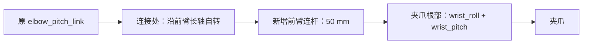

# Mini3 双侧 7 自由度手臂搬运

当前版本将双侧新增前臂连杆缩短为 **50 mm**，保留根部沿前臂 X 长轴自转及末端腕 roll/pitch。根部接口仍名为 `elbow_yaw_joint`，转动时连接处保持笔直。`mini3_pick_carry_7dof.py` 使用已有 Sonic 5200 策略控制身体，七关节位姿 IK 控制右臂；默认窗口已改为 **mujoco_viewer**。短杆在无窗口与实际 `mujoco_viewer` 窗口两次完整测试中均用 **32.86 s 仿真时间**完成夹取、携物行走和入篮，全部记录逐值一致，桌面保持 **0.5 m**。

## 运行

当前环境已安装 `mujoco-python-viewer==0.1.4`，通过 `mujoco_viewer.MujocoViewer` 打开窗口。在工程根目录激活现有 MuJoCo 环境，打开窗口后按 **P** 开始：

```bash
source active-adaptation/venv/mjlab/.venv/bin/activate
python mini3_pick_carry_7dof.py --start-paused
```

XML 在启动时加载。连杆长度更新后，请关闭已有窗口并重新运行命令，以加载 50 mm 模型。

若需要在该环境补装同版本窗口依赖，可在工程根目录运行：

```bash
UV_CACHE_DIR=.cache/uv .cache/uv-tool/bin/uv pip install \
  --python active-adaptation/venv/mjlab/.venv/bin/python \
  mujoco-python-viewer==0.1.4
```

无窗口运行：

```bash
python mini3_pick_carry_7dof.py --headless --duration 60 \
  --output outputs/mini3_pick_carry_7dof
```

默认场景为 `any4hdmi/assets/robots/mini3_mjlab/scene_pick_carry_7dof.xml`，参考动作仍为 `Neutral_walk_forward_005__A057.npz`。机器人与蓝块初始前向距离 3 m；两个桌面高 0.5 m，三个方块及篮子位于行走通道右侧。默认先行走到蓝块前，再夹取、抬起、携物行走和释放入篮。

当前短杆已在 0.5 m 桌高下完成无窗口完整搬运，因此保留该高度。其他操作若需要更低桌面，可通过下方场景生成命令的 `--table-height` 调整，并重新验证该高度下的抓取和连杆避障。

沿用原入口的参数与快捷键：**P** 暂停、**F** 跟随视角、**F8** 总览、**F9** 头部 RGB、**F10 / F11** 左 / 右夹爪 RGB、**Esc** 退出。可用 `--camera head_rgb` 选择初始视角，`--policy` 指定带同名 YAML 的 ONNX，`--motion` 指定参考动作。`--headless` 不能与 `--start-paused` 组合。

鼠标左键拖拽旋转视角，右键拖拽平移，中键拖拽或滚轮缩放；按住 **Shift** 可切换旋转/平移方向。右键平移或双击聚焦后自动关闭跟随，按 **F** 恢复。鼠标适配已修复 `mujoco_viewer 0.1.4` 与当前 MuJoCo 3.11 的相机调用、双击选择接口不兼容导致退出的问题，修改后需重新启动脚本。

## 独立模型与关节接口

| 文件 | 用途 |
| --- | --- |
| `mini3_gripper_7dof.xml` | 新双臂七自由度机器人，`nq=38, nv=37, nu=29` |
| `scene_pick_carry_7dof.xml` | 新桌面搬运场景，`nq=59, nv=55, nu=29` |
| `mini3_gripper.xml`、`scene_pick_carry.xml` | 保留的原双夹爪模型与场景 |

以上 XML 均位于 `any4hdmi/assets/robots/mini3_mjlab/`。以下命名中 `{side}` 取 `left` 或 `right`；轴方向按所在连杆的局部坐标定义，前臂延长方向为局部 +X。

左右两侧的关节沿新增连杆按以下顺序分布：



`elbow_yaw` 位于 `elbow_pitch_link` 与新增连杆的连接处，绕模型局部 **X 长轴**自转。改变该关节角度时，新增连杆的长轴方向与原前臂一致，腕部转心相对原前臂的位置保持不变，因此连接处不会折弯。两根腕轴位于新增连杆另一端的夹爪根部，转心重合；根部自转轴转心到每根腕轴转心的距离均为 **50 mm**。腕轴调整夹爪相对连杆的朝向。

下图展示新模型右前臂的 **−90°、0°、+90°** 根部自转角，原上游关节保持不动，腕 roll/pitch 均固定为 0。橙色箭头标示原前臂的长轴方向；延长杆始终笔直，夹爪绕该方向转动。这是 MuJoCo 静态运动学与渲染演示，没有策略推理或物理推进。


| 新关节名 | 位置与旋转轴 | 范围 |
| --- | --- | --- |
| `{side}_elbow_yaw_joint` | 原前臂末端、50 mm 延长段根部，沿局部 X 长轴自转 | ±π/2 |
| `{side}_wrist_roll_joint` | 50 mm 延长段末端、掌根，绕局部 X | ±π |
| `{side}_wrist_pitch_joint` | 与 wrist_roll 共用掌根位置，绕局部 Y | ±π/2 |

腕部两轴位于同一个掌部 body，按 roll、pitch 顺序旋转，使用既有掌部质量和惯量。执行器名为关节名追加 `_ctrl`。原 21 个执行器及两个夹爪执行器顺序不变，六个新增力矩执行器追加在后；控制和 keyframe 都按名称映射，不能把新模型的 `qpos[7:]` 当成原策略的 21 维关节向量。

每个新轴复制同侧 `elbow_pitch` 的物理参数：`armature=0.0019 kg·m²`、`damping=0.1 N·m·s/rad`、`frictionloss=0.7 N·m`，执行器限矩为 **±12.5 N·m**。没有新增实体电机外壳。50 mm 连杆保持原 100 mm 胶囊体的材料密度与 11 mm 半径，按圆柱加两端半球的完整体积缩放质量，每根由 60 g 变为 **33.837 g**；质心与转动惯量由新几何重新计算。掌部及双指合计仍为 140 g，因此每侧新增总质量为 **173.837 g**，机器人总质量为 **12.9042547186 kg**。头部及双爪 RGB 相机仍为零质量虚拟传感器，掌相机随缩短后的夹爪位置移动。

重新生成新模型和场景：

```bash
python any4hdmi/scripts/generate_mini3_gripper.py --articulated-arms --extension-length 0.05
python any4hdmi/scripts/generate_mini3_pick_scene.py \
  --robot-xml any4hdmi/assets/robots/mini3_mjlab/mini3_gripper_7dof.xml \
  --output any4hdmi/assets/robots/mini3_mjlab/scene_pick_carry_7dof.xml \
  --start-distance 2.72 --surface table --table-height 0.5 \
  --cube-layout longitudinal --basket-x 1.3 --basket-y -0.3
```

生成器的 `extension_length` / `--extension-length` 参数单位为米；七自由度版本默认 0.05，原非七自由度版本默认仍为 0.1。原 `mini3_gripper.xml` 与旧场景文件保持不变。

## 电机与操作控制

策略没有重新训练，仍采用原来的 21 维关节契约。原四个右臂关节的 IK 目标写入原策略关节参考，并组合到其执行目标中；三个新增右臂关节由独立控制器驱动。初始行走时，新增轴按 yaw、roll、pitch 顺序采用左侧 `[0, 0.6, 0.4] rad`、右侧 `[0, -0.6, 0.4] rad` 的收纳目标；只在 reset 初始化时设置这些额外关节的初始 `qpos`。操作右臂后其新增轴跟随 IK，左侧保持收纳目标，左夹爪张开。原 21 维行走参考与网络输入输出维数保持不变。

新增电机明确采用原肘关节的 **4310P** 电流环响应、延迟、TN 转速—力矩限制和 KT 输出映射，而非理想瞬时力矩。它们的负载惯量较小，位置控制环与电机物理参数分开设置：新增六轴采用 **kp=20、kd=0.4**；原四个右臂关节采用 **kp=30、kd=0.8**。重力/偏置力矩前馈、受限积分、1.5 rad/s IK 参考限速及关节目标裁剪继续启用。

七关节 IK 同时优化指垫中心位置与掌部朝向，并对实体几何间小于 **4 mm** 的间隙加入碰撞距离惩罚。短杆抓取时掌部保持水平，目标 yaw 为 **−0.5 rad（约 −28.6°）**，沿水平斜向接近方块。抓取中心位于已有 TCP 局部 −X 方向 15 mm，最终接近高度为实际方块中心上方 **2 mm**。

本任务将右肩 roll 的 IK 操作范围设为 `[-1.4, 0.15] rad`，右腕 roll 设为 `[-1.5, 1.5] rad`，并限制右肩 pitch 不小于 `-2 rad`、右肘 pitch 不大于 `2.4 rad`，避免避障和升降过程中切换到肘部翻转的冗余解。该限制只用于当前任务选解，XML 中完整的关节自由度与物理范围保持不变。根部自转轴仍使用完整 **±π/2** 范围。

IK 在独立数据上计算，短杆偏好初值为 `[-0.1, -0.3, -0.3, 0.45, 0, 0.2, -0.25] rad`，依次对应肩 pitch/roll/yaw、原肘 pitch、根部自转、腕 roll/pitch。只有 `REACH`、`LOWER` 会将该姿态作为额外候选初值；`CLEAR_ARM` 从实际关节状态重置初值，抬起及持物阶段连续沿用局部解。偏好初值中的根角 0 不限制其后实际转动。

在 `LIFT`、`CARRY`、`PLACE` 中，IK 根据每次实测的方块相对指垫变换，计算各候选手臂姿态对应的方块位姿，用于碰撞距离评估。候选物体位姿只写入 IK 的独立数据，避免将已被搬动的方块当成停在旧位置的障碍物。主仿真的方块始终是自由物体，继续由接触与摩擦驱动。

抬手避让分两段：先用 **1.5 s** 将夹爪后退 5 cm，并向右移动到蓝块中心外侧 3 cm 的位置，同时保留初始掌姿态；随后用 **3 s** 抬高手臂并逐渐转为水平斜向抓取姿态，再停留 **0.5 s** 后向方块伸手。这条路径为髋部和桌腿留出避让空间。

闭爪前先检查实际位姿：方块在指垫坐标系的 X / Y 包络（中心偏移绝对值加旋转后的半尺寸）不得超过 33 mm，Z 中心偏差不得超过 10 mm，掌部相对目标朝向的角误差不得超过 0.12 rad；未满足则停止，不继续合爪。

闭爪阶段冻结七关节 IK 参考目标，底层位置环和积分继续工作。右夹爪仍使用原 XML 位置伺服。将方块实际姿态投影到指垫坐标系后，以 Y 方向投影半宽减 **2 mm** 作为闭爪目标，裁剪至 `[0, 0.035] m`；在 **1 s** 内从张开位置平滑接近该目标。`CLOSE` 阶段仍保留 **1.2 s** 后检查双侧接触。抬起和携物时持续更新投影宽度，维持每侧 2 mm 的位置预压，适应斜抓后方块朝向的变化。抬起从闭爪结束时的实际指垫中心和掌姿态开始，减少阶段切换时的目标跳变。

到达篮子后，释放目标选择篮内离当前方块最近的安全位置。控制器读取篮壁实际内侧边界，扣除方块旋转后的半尺寸，并额外保留 **30 mm** 水平余量；释放高度保证方块底部高于篮沿至少 20 mm。夹爪目标同时补偿实际方块与指垫中心的偏移，使方块本身处于安全区域上方。此过程不移动篮子或重设方块位置。

自动搬运中没有骨盆支撑、物体焊接、外力稳定或阶段间物体位置重设。抓取依靠真实碰撞与摩擦。关节隔离诊断使用的固定约束不进入此运行入口。

## 碰撞监视与离线审核

延长杆、掌部和手指的实体碰撞保持启用，仅排除必要的直接机械连接接口。非邻接自碰撞、桌面、地面和其他物体不会为完成任务而屏蔽。在 `APPROACH`、`CLEAR_ARM`、`REACH` 中，手指与目标方块也纳入 IK 避障与实际接触监视，避免尚未到位就推动方块。从 `LOWER` 开始允许抓取所需的手指接触；掌、前臂和腕部接触目标方块仍视为异常。

运行时每 **2 ms** 检查一次 MuJoCo 实际解算的双臂接触，记录异常几何对、首次时间和最大穿透；异常接触穿透超过 **2 mm** 时立即中断当前控制周期，余下物理子步不再执行，并保存 `FAILED` 与原因。控制周期仍为 20 ms，每周期执行 10 次 `mj_step`。

轻量显示适配器 `mini3_task_viewer.py` 为 `mujoco_viewer` 保存完整独立的 `MjModel` / `MjData`；每帧复制状态并只在显示副本上执行 `mj_forward`，鼠标扰动与透明显示等操作也只影响副本。主循环管理 50 Hz 控制与 **P** 暂停，窗口库自身的暂停、单步与速度控制不改变仿真步进。阴影和反射仅在显示层关闭，以消除原 STL 的阴影斑点。

运行结束后，针对全部保存帧独立审核所有手臂实体几何对，包括可能被 MuJoCo 碰撞过滤器忽略的几何对：

```bash
python audit_mini3_arm_collisions.py \
  --trajectory outputs/mini3_pick_carry_7dof/trajectory.npz \
  --scene any4hdmi/assets/robots/mini3_mjlab/scene_pick_carry_7dof.xml \
  --output outputs/mini3_pick_carry_7dof/arm_collision_audit.json
```

盒体之间用 15 个分离轴检验（SAT）；其他几何先查询穿透，再查询至多 5 mm 的近距，避免大距离凸体查询伪差。正的 SAT 间隙或达到查询上限的结果是保守下界，不应当作精确欧氏距离。离线审核使用独立模型和数据，检查每个保存帧，不执行策略或物理推进；它不等价于对保存帧之间所有连续姿态的证明。

## 感知、记录和回放

当前控制器直接读取 MuJoCo 中方块和篮子的真实位姿。RGB 摄像头只用于观察，没有颜色识别、目标检测或视觉定位；因此这仍是已知目标状态的仿真任务。

输出包含 `report.json`、`trajectory.npz` 和单独生成的碰撞审核报告。除原有实际关节状态、物体位置和接触力外，新轨迹记录 `arm_command`、`arm_integral`、`extra_command`，报告记录新增关节、电机与控制增益、逐物理步接触检查，以及 `visualization` 为 `headless` 或 `mujoco_viewer`。是否完成任务应同时查看入篮判定和碰撞审核。

渲染已有记录时必须指定新场景：

```bash
python render_mini3_pick_carry.py \
  --trajectory outputs/mini3_pick_carry_7dof/trajectory.npz \
  --scene any4hdmi/assets/robots/mini3_mjlab/scene_pick_carry_7dof.xml \
  --output outputs/mini3_pick_carry_7dof/demo.mp4
```

这是记录轨迹回放，没有策略推理或新的物理积分。若要重新测试控制器，运行 `mini3_pick_carry_7dof.py`。

## 50 mm 模型验证

模型回归共 **9 项测试通过**，覆盖长度默认值与显式参数、恒密度质量/质心/惯量、原 21 维接口、实体碰撞及原 100 mm 模型兼容性。不折弯检查覆盖机器人与场景 XML、左右手臂、3 种上游姿态和含端点的 9 个根轴角度，共 **108 种组合**；转动时腕转心保持距根轴 **50 mm**。[50 mm 静态对照记录](../outputs/mini3_forearm_axial_check_50mm/kinematic_check.json) 保存了模型哈希与测量结果。

50 mm 模型的无窗口 [report.json](../outputs/mini3_pick_carry_7dof_50mm_diagonal/report.json) 为 `SUCCESS`，仿真用时 **32.86 s**，保存 **1643 帧**；16430 次逐 2 ms 接触检查的异常列表为空。报告确认双侧杆长 0.05 m、每杆质量 0.0338372093 kg，以及 `real_motor=true`、`base_support=false`、`object_welds=false`。蓝块最终中心为 `(1.250474, -0.242811, 0.529995) m`，通过篮内稳定落地判定。

| 实测量 | 结果 |
| --- | --- |
| 初始机器人至蓝块的前向距离 | 3.000 m |
| 接近阶段机器人前向位移 | 2.797 m |
| 携物阶段机器人前向位移 | 0.975 m |
| 方块中心最高高度 | 0.715325 m |
| 机器人基座最低高度 | 0.425993 m |
| 基座上方向的最小世界 Z 分量 | 0.980163 |

实际 `mujoco_viewer` 窗口的[完整复验报告](../outputs/mini3_pick_carry_7dof_50mm_viewer/report.json)同样为 `SUCCESS`，仿真用时 **32.86 s**；`visualization=mujoco_viewer`，16430 次接触检查未记录异常。两次运行各 **1643 帧**，全部 **11 个轨迹数组逐元素完全一致**，详见[窗口与无窗口对比](../outputs/mini3_pick_carry_7dof_50mm_viewer/trajectory_comparison_with_headless.json)。可查看该窗口的[启动检查画面](../outputs/mini3_mujoco_viewer_smoke/window.png)。

[无窗口碰撞审核](../outputs/mini3_pick_carry_7dof_50mm_diagonal/arm_collision_audit.json)与[窗口碰撞审核](../outputs/mini3_pick_carry_7dof_50mm_viewer/arm_collision_audit.json)各覆盖全部 **1643 帧、345 个几何对**，异常碰撞对、被过滤的异常碰撞对和最大异常穿透均为 **0**。[手指—方块接触审核](../outputs/mini3_pick_carry_7dof_50mm_viewer/finger_target_contact_audit.json)确认 `APPROACH`、`CLEAR_ARM`、`REACH`、`LOWER` 均无接触，首次接触发生于 `CLOSE` 阶段 **19.06 s**。

[逐帧直杆审核](../outputs/mini3_pick_carry_7dof_50mm_diagonal/forearm_alignment_audit.json)同样覆盖 1643 帧，右根关节实际转角覆盖 `[-0.589, 0.787] rad`。双侧杆长误差最大约 `2.08×10⁻¹⁶ m`、腕转心漂移约 `7.64×10⁻¹⁶ m`、轴向夹角约 `3.93×10⁻¹⁶ rad`，均在浮点舍入量级，确认记录中保持 50 mm 直杆结构。

当前窗口运行的[完整轨迹](../outputs/mini3_pick_carry_7dof_50mm_viewer/trajectory.npz)及[对应 50 mm 场景快照](../outputs/mini3_pick_carry_7dof_50mm_viewer/model_snapshot/scene_pick_carry_7dof.xml)已保存，便于按实际模型回放。固定场景复验不代表随机扰动成功率或实机保证，当前控制也没有 RGB 目标识别。碰撞审核针对记录帧和模型实体几何，范围限制见上文。

## 历史模型与回放

旧 100 mm 长轴自转模型的[报告](../outputs/mini3_pick_carry_7dof_axial/report.json)与[场景快照](../outputs/mini3_pick_carry_7dof_axial/model_snapshot/scene_pick_carry_7dof.xml)保存在 `mini3_pick_carry_7dof_axial`，生成短杆前已备份并[记录哈希](../outputs/mini3_pick_carry_7dof_axial/model_snapshot/snapshot_provenance.json)。更早错误 Z 轴模型保存在 `mini3_pick_carry_7dof_held/model_snapshot/`。旧轨迹回放必须通过 `--scene` 选择对应快照，历史结果不属于当前 50 mm 模型。
