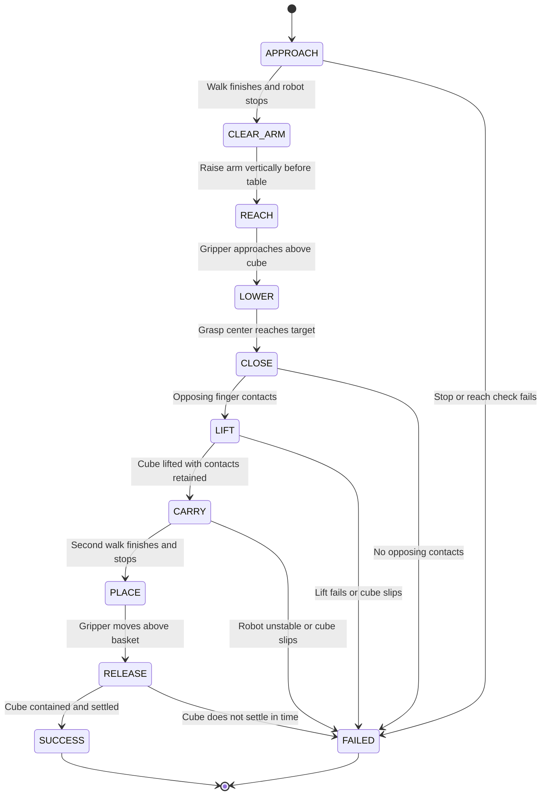

# Mini3 walking and carrying test

`mini3_pick_carry.py` has completed policy-driven approach, grasping, loaded walking, and basket placement in the fixed tabletop scene. After shortening the three phase waits, both headless and GUI full-task revalidation succeeded in **31.64 seconds of simulated time**, 3.52 seconds less than the previous 35.16-second baseline, with movement speeds unchanged. It uses the ONNX export of the existing Sonic `checkpoint_5200.pt` for walking, with right-arm IK and independent gripper control for manipulation. The policy has not been retrained. Measured results and their scope appear in the final section.

## Launch and camera views

Run from the repository root, then press **P** to begin:

```bash
source active-adaptation/venv/mjlab/.venv/bin/activate
python mini3_pick_carry.py --start-paused
```

Run without a viewer and save this trial:

```bash
python mini3_pick_carry.py --headless --duration 60 \
  --output outputs/mini3_pick_carry_verify
```

The default reference clip is `any4hdmi/output/mini3/sonic/motions/211117/Neutral_walk_forward_005__A057.npz`; the default scene is `any4hdmi/assets/robots/mini3_mjlab/scene_pick_carry.xml`. The script reuses its policy export cache, or exports on CPU first if the current configuration has no complete cache. Use `--policy /path/to/policy.onnx` to select an export with its matching YAML, or `--motion` and `--scene` to change the reference and scene. Changing these inputs requires renewed validation of stopping position and grasp capability.

| Key / option | Action |
| --- | --- |
| **P** | Pause / resume policy inference and physics |
| **F** | Toggle robot following in the overview |
| **F8** | Overview |
| **F9** | Head RGB camera, pitched 45° forward and downward |
| **F10** / **F11** | Left / right gripper RGB camera |
| **Esc** | Exit and save existing records |
| `--camera head_rgb` | Start from the head camera view |
| `--duration 60` | Limit simulated time to 60 seconds; paused time does not count |

All three RGB cameras remain 640 × 480. `--headless` cannot be combined with `--start-paused`. Exit code 0 requires the final basket-containment check to pass. Failure, timeout, or early exit produces exit code 1 and a reason in the report.

Configure the three waits independently, in simulated seconds:

| Option | Action | Current default | Previous baseline |
| --- | --- | --- | --- |
| `--approach-wait` | Hold the standing pose after the first walking reference ends, before reaching | 2.0 s | 3.0 s |
| `--lift-wait` | Hold the grasp after the 3 s lifting motion, before carrying | 0.5 s | 1.0 s |
| `--basket-wait` | Hold the standing pose after the second walking reference ends, before reaching over the basket | 1.0 s | 3.0 s |

Values must be finite and non-negative. The waits appended to walking references round upward to 20 ms control periods; phase changes also occur at control boundaries. These options adjust target-hold time only. Moving reference samples, the 3 s arm lift, the 1 s pose transition before carrying, arm speed limits, and the 50 Hz / 500 Hz control rates remain unchanged. Altering waits still changes subsequent physical states and requires grasp and stopping revalidation; the current defaults have passed complete trials.

Restore the previous waits:

```bash
python mini3_pick_carry.py --start-paused \
  --approach-wait 3 --lift-wait 1 --basket-wait 3
```

## Tabletop scene and distances

Because the crouching trials did not satisfy ground-grasp conditions, the carrying scene uses two **50 cm high tabletops**. Blue, green, and red cubes are arranged along the right side of the walking path; the basket is on a second table farther ahead. The robot walks alongside the tables, which do not block the path. Table height was adjusted using actual extended-finger collision checks to improve fingertip clearance when the gripper tilts downward.

In the default world coordinates, the root starts at `x = -2.72 m, y = 0`, and the blue cube center is at `x = 0.28 m, y = -0.24 m, z = 0.5205 m`. Its initial **forward separation is exactly 3.00 m**, with a 24 cm offset to the robot's right. This is forward distance, not three-dimensional Euclidean distance. The basket center is at `x = 1.30 m, y = -0.30 m`, with its bottom at 50 cm.

The first reference walk defaults to `--approach-distance 2.65`. In an existing two-stage walking probe with grippers and no carried object, the first stage traveled approximately **2.78 m** physically; the subsequent 1.00 m reference stage traveled approximately **1.00 m** physically. Reference distance differs from actual displacement, so these values leave room to reach toward the blue cube. They are calibration results for the current motion and model, not a guarantee for loaded carrying. `--carry-distance 1.0` sets the second reference distance.

With the current default waits, the first stage traveled **2.769 m**, and the loaded second stage traveled **0.966 m**. Both passed the stopping checks. The previous baseline traveled 2.768 m and 0.957 m, respectively.

`mini3_motion_reference.py` retains the original motion's natural start and stop, removes a middle segment selected by matching leg poses, and places the reference coordinates in the task frame. Phase changes install a continuous reference while retaining policy observation history. These operations modify reference inputs only; joint torques, gravity, and contacts still determine the physical floating-base position.

## Controller structure and phase checks

The policy retains its original **21-joint** input/output and observation contract. Four finger slide joints and two gripper actuators have separate mappings and do not alter the policy joint order. Inference runs at 50 Hz; MuJoCo and the real-motor model run at 500 Hz.

The existing Sonic policy controls approach and carrying locomotion. During right-arm manipulation, IK solves the three shoulder joints and one elbow joint in a separate kinematic state, respecting joint limits. The resulting targets update future joint references and replace those four execution targets; the policy continues controlling the remaining joints. This combines the policy with an arm controller without changing network weights. IK joint references change by at most 0.03 rad per 20 ms, equivalent to 1.5 rad/s; execution targets are clipped to joint limits after compensation. The grasp target uses the finger-pad midpoint, 15 mm along the existing TCP's local −X axis, to avoid trapping the cube only at the fingertip edges.

Right-arm manipulation uses `kp = 70`, `kd = 3`, `qfrc_bias` gravity/bias-torque feedforward, and bounded integration of position error. The integral state is limited to ±0.12, its target-offset gain is 2, and the final target remains within joint limits. The existing real-motor response delay, TN speed–torque limits, KT output model, and parallel-ankle mapping remain enabled. Right-arm torques also pass through this chain and torque limits.

The right gripper uses the XML's independent position servo: `ctrl = 0.035` produces an approximately 70 mm inner opening, while `ctrl = 0` requests closure. The left gripper stays open. Holding the cube depends on actual finger–cube collision and friction. The task does not weld the cube, enable pelvis support, add stabilizing external forces, or reset physical robot/object positions at phase transitions.

Physics retains the project's original update order: **10 calls to `mj_step` per control tick**, without an additional `mj_forward` on the main simulation data. That extra call recomputes dynamics and constraints and changes the sampling time for the next feedforward update; the ablation confirmed that it changes contact and grasp behavior in this task. The GUI uses `viewer.sync(state_only=True)` to update poses on a display copy without changing the main physics sequence just to refresh the image.



The tabletop version keeps the robot standing and lifts the cube by raising the arm before walking again; it does not insert an additional deep crouch and stand-up motion. Before reaching across the table, `CLEAR_ARM` keeps the gripper's current horizontal position and raises it vertically above tabletop level. `REACH` then extends toward the cube from above, avoiding an approach that drives the fingertips into the underside of the table edge. After release, basket containment considers the rotated cube's bounds, height above the basket floor, and speed, with 0.8 seconds of stable settling required.

The following failure thresholds reject invalid trials; they do not replace full-task validation.

| Check | Stop condition |
| --- | --- |
| Upright posture | Root height below 0.28 m, or the root's local vertical axis projected onto world vertical below 0.65 |
| Stop after either walk | Horizontal speed above 0.06 m/s |
| Reachability | IK residual above 1.5 cm at the grasp target, or above 2 cm at the release target |
| Position before closure | Actual grasp-center distance from the target above 1.8 cm |
| Closing contact | Either finger's normal contact force below 0.1 N after 1.2 s of closure |
| Lift | Less than 10 cm cube elevation after `3 + --lift-wait` seconds (3.5 s by default), or either contact force below 0.1 N |
| Slipping during transport | Either contact force below 0.03 N for over 0.3 s, or grasp-center distance from cube center above 11 cm |
| Release | More than 5 s without 0.8 s of continuous stable basket containment |

Inference failure, non-finite torque/simulation state, or unexpectedly enabled pelvis support also terminates execution instead of advancing to the next phase.

## Target localization and recorded evidence

The controller currently reads the blue cube's and basket's true MuJoCo poses to compute gripper targets. RGB cameras provide observation views; **no color recognition, object detector, or visual pose estimator is running**. This tests a simulation controller with known target states. Autonomous pickup on a physical robot would require replacing those true-state inputs with calibrated camera perception and validating the resulting localization and control errors.

The output directory contains `report.json` and `trajectory.npz`. The report records `success`, `failure`, the final phase, phase timestamps, initial/final robot and cube positions, reference-motion metadata, requested waits in `wait_times_s`, and support/weld/real-motor flags. The trajectory stores actual `qpos`, `qvel`, TCP, finger-pad grasp center, cube position, and opposing finger contact forces. Assess completion using `success` and final containment; finishing the walk or closing the fingers does not by itself establish success.

Render the recorded successful trajectory to video:

```bash
python render_mini3_pick_carry.py \
  --trajectory outputs/mini3_pick_carry_wait_balanced/trajectory.npz \
  --output outputs/mini3_pick_carry_wait_balanced/demo.mp4
```

This is **recorded trajectory replay**: existing `qpos` and `qvel` restore each frame in separate rendering data. It performs no policy inference and no further physics integration. The video explicitly labels itself as a replay and displays the phase. Add `--camera head_rgb` or `--camera right_gripper_rgb` to select a camera, or `--snapshots-only` to save stage images only. The video visualizes an existing test; run `mini3_pick_carry.py` to execute the policy again.

The previously generated [35.16-second demonstration video](../outputs/mini3_pick_carry_verified/demo.mp4) uses the previous waits and does not represent the current default timing.

## Crouching and ground reach

The local Sonic / BeyondMimic policies track reference motions using reference joint and body states. They do not expose direct forward-velocity or crouch-height commands. Walking and crouching require suitable references followed by validation of the actual physics rollout.

Three stooping/crouching clips were evaluated with the ONNX export of the downloaded Sonic `checkpoint_5200.pt` on the robot with bilateral 10 cm arm extensions and grippers. The tests use policy inference at 50 Hz, MuJoCo physics at 500 Hz, and the existing real-motor response, TN, KT, and parallel-ankle models. The robot stands freely, without pelvis support, stabilizing external forces, or body welds. Reference poses never overwrite the physical robot after initialization. The grippers remain open. Cameras are massless virtual sensors; the two arm extensions and grippers still add 0.4 kg in total.

| Reference motion | Duration | Minimum right TCP height | Minimum surface height across all fingers | Mean / maximum root position error |
| --- | --- | --- | --- | --- |
| `Neutral_stoop_down_001__A057` | 6.82 s | 13.37 cm | 10.82 cm | 3.98 / 7.69 cm |
| `Neutral_stoop_down_003__A057` | 5.60 s | 11.70 cm | 8.88 cm | 12.14 / 47.63 cm |
| `injured_torso_stoop_down_003__A057` | 12.00 s | 17.01 cm | 13.51 cm | 9.65 / 18.24 cm |

All three clips returned to standing. The second has material translational tracking drift. Actual finger surfaces remain above the top of a 4 cm cube on the floor, so these three policy/reference combinations cannot directly grasp that ground-level cube. This supports using the user-authorized tabletop alternative. It is not a proof that every possible reference motion or future controller is unable to reach the floor.

Reference forward kinematics alone cannot establish policy reach. Checking every reference frame of `Neutral_stoop_down_001` brings the extended right TCP to approximately 1.09 cm, while the actual policy only reaches approximately 13.37 cm. In `injured_torso_stoop_down_003`, the reference root reaches approximately 18.91 cm, compared with approximately 33.17 cm in actual physics.

Reproduce the three tests:

```bash
source active-adaptation/venv/mjlab/.venv/bin/activate
python evaluate_mini3_reach.py
```

The script discovers a complete local export cache for Sonic 5200 automatically. Use `--policy /path/to/policy.onnx` to select an export with its matching YAML, or repeat `--motion /path/to/clip.npz` to select reference clips. Default outputs are stored in `outputs/mini3_policy_reach_audit/`:

- `summary.json` and per-motion JSON files: policy and motion paths, disabled support, actual TCP/finger minimum heights, reference FK, pose and position errors, and the stopping reason.
- Per-motion NPZ files: actual `qpos`, left/right `tcp`, `finger_bottoms`, `reference_tcp`, and a `stable` frame mask for plotting or further inspection.

Vertical overlap between fingers and a cube is only a necessary condition; it does not establish a stable grasp by itself. The reach test does not use object welds or hidden constraints to simulate successful grasping.

## Full-task test results

The validated configuration uses the default Sonic 5200 policy, default walking clip, 50 cm tabletop scene, and the original gripper position-servo closure command `ctrl = 0`. Current default waits are 2 s after approach, 0.5 s after lifting, and 1 s after stopping beside the basket.

| Test | Result | Evidence |
| --- | --- | --- |
| Current default waits, headless revalidation | `SUCCESS`, 31.64 s | [Report](../outputs/mini3_pick_carry_wait_balanced/report.json), [trajectory](../outputs/mini3_pick_carry_wait_balanced/trajectory.npz) |
| Current default waits, GUI revalidation | `SUCCESS`, 31.64 s | [Report](../outputs/mini3_pick_carry_wait_balanced_gui/report.json), [trajectory](../outputs/mini3_pick_carry_wait_balanced_gui/trajectory.npz) |
| Previous baseline waits of 3 / 1 / 3 s, headless | `SUCCESS`, 35.16 s | [Report](../outputs/mini3_pick_carry_verified/report.json), [trajectory](../outputs/mini3_pick_carry_verified/trajectory.npz) |
| Previous baseline waits of 3 / 1 / 3 s, GUI | `SUCCESS`, 35.16 s | [Report](../outputs/mini3_pick_carry_gui_verified/report.json), [trajectory](../outputs/mini3_pick_carry_gui_verified/trajectory.npz) |

Both current-default runs recorded **1582 frames**. All eight trajectory arrays are exactly equal element by element, and their reports are identical. GUI display and headless execution therefore reproduced the same trajectory under these fixed conditions. [Current GUI / headless comparison](../outputs/mini3_pick_carry_wait_balanced/gui_comparison.json)

The current-default revalidation raised the cube center to a maximum of **0.719262 m**, approximately **19.9 cm** above its initial center height on the table. Minimum root height was **0.424832 m**, and the minimum projection of the root's vertical axis onto world vertical was **0.980394**; the robot remained upright. The final cube center was approximately **`(1.30446, -0.30468, 0.529995) m`**; `cube_settled_inside_basket` was `true`, with actual basket-floor contact required by the success check.

For historical comparison, both previous-baseline runs recorded **1758 frames**. Framewise maximum absolute differences in `qpos`, `qvel`, and cube position were **0.0**, with identical phase sequences. [Previous GUI / headless comparison](../outputs/mini3_pick_carry_verified/gui_comparison.json) The previous baseline's maximum cube-center height was **0.715045 m**, and its final center was approximately **`(1.30445, -0.30320, 0.529995) m`**.

Independent kinematic and contact checks of the previous-baseline trajectory measured approximately **0.82 mm** maximum cube displacement relative to the finger-pad frame during loaded walking, with both finger contacts retained throughout. The final cube had **4 contacts** with the basket floor, approximately **4.8 µm** penetration, and near-zero velocity, confirming that it had settled on the bottom. These checks operate on separate recorded-state data and do not change the rollout. These measurements belong to the previous baseline, not the current wait configuration. [Previous-baseline grasp verification appendix](../outputs/mini3_standard_step_ablation/grip_analysis.json), [previous-baseline final contact check](../outputs/mini3_standard_step_ablation/final_basket_contact_check.json)

These are repeat runs of a fixed scene and reference motion. Success rates under randomized initial positions, disturbances, object mass, or friction have not been measured, and the results are not a physical-robot guarantee. The policy has not been retrained for general grasping, and target localization still uses true MuJoCo states.
