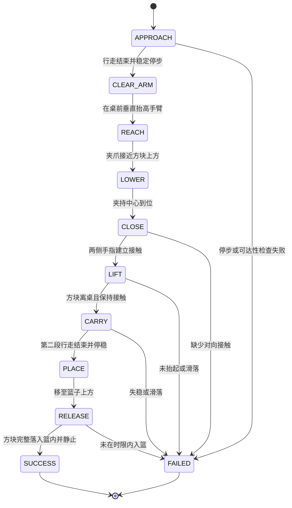

# Mini3 行走与搬运测试

`mini3_pick_carry.py` 已在固定桌面场景中完成实际策略驱动的接近、夹取、携物行走和入篮。缩短三个阶段的等待后，无窗口与 GUI 完整复验均在 **31.64 秒仿真时间**内成功完成，比旧等待基线的 35.16 秒减少 3.52 秒，动作速度保持不变。它使用已有 Sonic `checkpoint_5200.pt` 的 ONNX 导出控制行走，并用右臂 IK 与独立夹爪控制器操作物体，没有重新训练策略。实测结果和适用范围见文末。

## 启动与视角

在工程根目录运行，窗口打开后按 **P** 开始：

```bash
source active-adaptation/venv/mjlab/.venv/bin/activate
python mini3_pick_carry.py --start-paused
```

无窗口运行并保存本次结果：

```bash
python mini3_pick_carry.py --headless --duration 60 \
  --output outputs/mini3_pick_carry_verify
```

默认参考动作是 `any4hdmi/output/mini3/sonic/motions/211117/Neutral_walk_forward_005__A057.npz`，默认场景是 `any4hdmi/assets/robots/mini3_mjlab/scene_pick_carry.xml`。脚本复用策略导出缓存；若当前配置没有完整缓存，会先执行 CPU 导出。可以通过 `--policy /path/to/policy.onnx` 指定带同名 YAML 的已有导出，或通过 `--motion`、`--scene` 指定动作和场景。更换策略、动作或场景后需要重新验证停止位置和抓取能力。

| 按键 / 参数 | 作用 |
| --- | --- |
| **P** | 暂停 / 继续策略与物理仿真 |
| **F** | 总览视角跟随机器人开关 |
| **F8** | 总览 |
| **F9** | 头部 RGB 摄像头，向前下俯 45° |
| **F10** / **F11** | 左 / 右夹爪 RGB 摄像头 |
| **Esc** | 退出并保存已有记录 |
| `--camera head_rgb` | 直接从头部摄像头视角启动 |
| `--duration 60` | 最长 60 秒仿真时间，暂停时不累计 |

三个 RGB 摄像头仍为 640 × 480。`--headless` 不能与 `--start-paused` 同时使用。程序只有通过最终入篮判定才返回退出码 0；失败、超时或提前退出返回 1，并在报告中记录原因。

三个阶段的等待可单独配置，单位为仿真秒：

| 参数 | 作用 | 当前默认 | 旧等待基线 |
| --- | --- | --- | --- |
| `--approach-wait` | 第一段行走参考结束后，保持站姿再进入伸手阶段 | 2.0 s | 3.0 s |
| `--lift-wait` | 3 s 抬臂动作完成后，保持夹持再进入携物行走 | 0.5 s | 1.0 s |
| `--basket-wait` | 第二段行走参考结束后，保持站姿再向篮子伸手 | 1.0 s | 3.0 s |

参数必须为有限非负数；行走末尾等待按 20 ms 控制周期向上取整，阶段切换也在控制周期边界发生。这些参数只调整目标保持时间，行走参考的移动样本、3 s 抬臂动作、携物前 1 s 姿态过渡、手臂限速和 50 Hz / 500 Hz 控制频率均保持不变。改变等待仍会改变后续物理状态，需要重新验证夹持和停步；当前默认组合已完成整段复验。

恢复旧等待配置：

```bash
python mini3_pick_carry.py --start-paused \
  --approach-wait 3 --lift-wait 1 --basket-wait 3
```

## 桌面场景与距离

下蹲测试未达到地面夹取条件后，搬运场景采用两个 **50 cm 高的桌面**。蓝、绿、红三个方块沿前进方向排列在通道右侧；篮子放在更前方的另一张桌子上，机器人沿桌边行走，桌体不横挡通道。桌高按加长夹指的实际碰撞检查调整，以改善夹爪下倾时指尖与桌面的间隙。

默认世界坐标中，机器人根部从 `x = -2.72 m, y = 0` 开始；蓝色方块中心位于 `x = 0.28 m, y = -0.24 m, z = 0.5205 m`。因此蓝块相对机器人起点的**前向距离为 3.00 m**，横向偏右 24 cm。这里的 3 m 是前向距离，不是三维欧氏距离。篮子中心为 `x = 1.30 m, y = -0.30 m`，底部高度 50 cm。

第一段参考行走距离默认 `--approach-distance 2.65`。已有带夹爪、无物体负载的两段行走探针中，第一段实际前进约 **2.78 m**，随后 1.00 m 参考段实际前进约 **1.00 m**。参考距离和实际位移不完全相同，因此采用这组数值让机器人在蓝块前留出伸臂距离。它们是当前动作和模型的校准结果，不是带物体搬运时的位移保证。`--carry-distance 1.0` 设置第二段参考距离。

当前默认等待配置的完整流程中，第一段实际前进 **2.769 m**，携带方块的第二段实际前进 **0.966 m**；两段结束时均通过停步检查。旧等待基线对应位移分别为 2.768 m 和 0.957 m。

参考轨迹由 `mini3_motion_reference.py` 处理：保留原动作自然起步与停步部分，从中段匹配腿部姿态后截短，并调整参考坐标到当前任务位置；阶段切换使用连续参考，保持策略观测历史。这里只修改策略输入的参考数据，物理机器人的根部位置仍由关节力矩、重力和接触决定。

## 控制结构与阶段判定

策略继续使用原来的 **21 个关节**与观测约定，新增四个手指滑动关节和两个夹爪执行器独立映射，不混入策略输入输出的关节顺序。策略以 50 Hz 推理，MuJoCo 和 real motor 模型以 500 Hz 更新。

接近与搬运行走使用已有 Sonic 策略。操作右臂时，IK 在独立运动学状态中求解肩部三个关节和肘部一个关节的目标，遵守关节限位；目标写入后续关节参考，并替换这四个关节的执行目标，其余关节继续由策略控制。这是策略与手臂控制器的组合，未改变网络权重。IK 关节参考每 20 ms 最多变化 0.03 rad，即限速 1.5 rad/s；叠加补偿后的执行目标再按关节限位裁剪。抓取目标使用指垫中点，位于已有 TCP 的局部 −X 方向 15 mm，避免仅用指尖边缘卡住方块。

右臂操作阶段使用 `kp = 70`、`kd = 3`，加入 `qfrc_bias` 重力/偏置力矩前馈，以及受限位置误差积分补偿。积分状态限制为 ±0.12，目标补偿系数为 2，最终目标仍受关节限位约束。原有 real motor 响应延迟、TN 转速—力矩限制、KT 输出模型和并联踝关节映射保持启用，右臂力矩同样经过该链路和力矩限幅。

右夹爪使用原 XML 的独立位置伺服：`ctrl = 0.035` 对应约 70 mm 指间开口，`ctrl = 0` 请求闭合；左夹爪保持张开。夹持依靠手指与方块的真实碰撞及摩擦，搬运过程不焊接方块、不启用骨盆支撑、不施加外力稳定，也不在阶段切换时重设机器人或方块的物理位置。

物理更新沿用工程原有顺序：每个控制周期只执行 **10 次 `mj_step`**，不在主仿真数据上额外调用 `mj_forward`。后者会重新计算动力学及约束，并改变下次前馈采样的时刻；消融实验已确认，它会改变本任务的接触与夹持结果。GUI 使用 `viewer.sync(state_only=True)` 在显示副本上更新姿态，不为刷新画面改变主仿真计算顺序。



桌面方案中机器人保持站立，通过抬臂把方块抬离桌面后继续行走，没有额外安排一次深蹲与起身。接近桌面前先执行 `CLEAR_ARM`：保持当前水平位置，在桌前垂直抬高夹爪到桌面上方，再执行 `REACH` 向方块上方伸手，避免指尖从桌边下方撞上桌面。释放后的入篮判定考虑方块旋转后的包围范围、篮内底部接触高度和速度，并要求稳定保持 0.8 秒。

状态机采用以下失效停止门槛。这些检查用于拒绝无效过程，不能替代完整测试结果。

| 检查 | 停止条件 |
| --- | --- |
| 直立姿态 | 根部高度低于 0.28 m，或根部局部竖直轴在世界竖直方向的投影低于 0.65 |
| 两段行走后的停步 | 水平速度高于 0.06 m/s |
| 可达性 | 抓取位置 IK 残差大于 1.5 cm，或篮子释放位置大于 2 cm |
| 闭爪前到位 | 夹持中心到目标的实际距离大于 1.8 cm |
| 闭爪接触 | 闭爪 1.2 s 后任一侧手指法向接触力低于 0.1 N |
| 抬起 | 抬起阶段 `3 + --lift-wait` 秒后（默认 3.5 s），方块升高不足 10 cm，或任一侧接触力低于 0.1 N |
| 搬运滑落 | 任一侧接触力低于 0.03 N 持续超过 0.3 s，或夹持中心与方块中心距离超过 11 cm |
| 释放 | 释放后超过 5 s，仍未满足连续 0.8 s 稳定入篮 |

推理失败、非有限力矩/仿真状态或意外启用骨盆支撑也会终止运行，不继续推进后续阶段。

## 目标定位与结果记录

当前直接读取 MuJoCo 中蓝色方块和篮子的真实位姿，再生成夹爪目标。RGB 摄像头用于观察，**没有运行颜色识别、目标检测或视觉位姿估计**。因此该任务验证的是已知目标状态下的仿真控制流程；迁移到真实机器人自主拾取，还需要把目标真值输入替换为相机标定、视觉定位等实际感知结果，并重新验证控制与定位误差。

输出目录包含 `report.json` 和 `trajectory.npz`。报告记录 `success`、`failure`、终止阶段、各阶段时间、初末机器人及方块位置、参考轨迹信息、请求的等待时间 `wait_times_s`，以及支撑/焊接/real motor 状态。轨迹保存实际 `qpos`、`qvel`、TCP、指垫抓取中心、方块位置和两侧手指接触力。判断完成情况应检查 `success` 和最终入篮条件；看到机器人走完或夹爪合拢并不足以判定成功。

将已记录的成功轨迹渲染为视频：

```bash
python render_mini3_pick_carry.py \
  --trajectory outputs/mini3_pick_carry_wait_balanced/trajectory.npz \
  --output outputs/mini3_pick_carry_wait_balanced/demo.mp4
```

这是**记录轨迹回放**：逐帧读取已有 `qpos`、`qvel`，在独立渲染数据中恢复姿态；不进行策略推理，也不继续物理积分。视频左上角会明确标注回放及阶段。可追加 `--camera head_rgb` 或 `--camera right_gripper_rgb` 选择摄像头，也可用 `--snapshots-only` 仅导出阶段截图。视频用于查看已有测试，重新执行策略应运行 `mini3_pick_carry.py`。

此前生成的 [35.16 秒演示视频](../outputs/mini3_pick_carry_verified/demo.mp4) 对应旧等待基线，不代表当前默认时序。

## 下蹲与地面可达性

本地的 Sonic / BeyondMimic 是参考动作跟踪策略，输入包含参考动作的关节和身体状态；它们没有直接的“前进速度”或“下蹲高度”命令。行走和下蹲需要提供相应参考动作，然后检验实际动力学结果。

先用下载的 Sonic `checkpoint_5200.pt` 对应 ONNX，在双臂加长 10 cm、双夹爪的机器人上测试了三个下蹲/弯腰动作。采用 50 Hz 策略推理、500 Hz MuJoCo 物理，以及原有 real motor 响应、TN、KT 和并联踝关节模型。机器人自由站立，未启用骨盆支撑、外力稳定或刚体焊接；初始化之后不再用参考姿态覆盖机器人状态。夹爪保持张开。摄像头是零质量虚拟传感器，双臂连杆与夹爪总增重仍为 0.4 kg。

| 参考动作 | 测试时长 | 右夹爪 TCP 最低高度 | 所有手指表面最低高度 | 根部位置误差均值 / 最大值 |
| --- | --- | --- | --- | --- |
| `Neutral_stoop_down_001__A057` | 6.82 s | 13.37 cm | 10.82 cm | 3.98 / 7.69 cm |
| `Neutral_stoop_down_003__A057` | 5.60 s | 11.70 cm | 8.88 cm | 12.14 / 47.63 cm |
| `injured_torso_stoop_down_003__A057` | 12.00 s | 17.01 cm | 13.51 cm | 9.65 / 18.24 cm |

三个动作都完成起身，第二个动作存在明显平移跟踪偏差。实际手指最低表面仍高于地面方块 4 cm 的顶部，因此这三种策略/参考动作组合无法直接夹取地面方块，可以使用用户授权的桌面场景方案。这不是对全部可能参考动作或后续控制器的不可达性证明。

不能仅依据参考动作的正向运动学判断策略是否够到：逐帧检查 `Neutral_stoop_down_001` 的参考姿态能让加长后的右 TCP 降到约 1.09 cm，而真实策略仿真最低为约 13.37 cm。`injured_torso_stoop_down_003` 的参考根部最低约 18.91 cm，实际最低约 33.17 cm。

复现三个测试：

```bash
source active-adaptation/venv/mjlab/.venv/bin/activate
python evaluate_mini3_reach.py
```

脚本自动发现本地 Sonic 5200 的完整导出缓存；也可用 `--policy /path/to/policy.onnx` 指定带同名 YAML 的导出策略，或重复 `--motion /path/to/clip.npz` 指定参考动作。默认输出到 `outputs/mini3_policy_reach_audit/`：

- `summary.json` 和各动作 JSON：策略路径、动作路径、支撑关闭、实际 TCP/指面最低高度、参考 FK、姿态与位置误差，以及停止原因。
- 各动作 NPZ：实际 `qpos`、左右 `tcp`、`finger_bottoms`、`reference_tcp` 和 `stable` 帧掩码，便于进一步绘图或复核。

“手指与方块在高度上重叠”只是一项必要条件，不能单独证明已形成稳定抓取。下蹲测试也没有用物体焊接或隐藏约束来模拟抓取成功。

## 全流程测试结果

已验证的配置使用默认 Sonic 5200、默认行走动作、50 cm 桌面场景以及原位置伺服闭爪命令 `ctrl = 0`。当前默认等待为接近后 2 s、抬起后 0.5 s、篮旁停步后 1 s。

| 测试 | 结果 | 记录 |
| --- | --- | --- |
| 当前默认等待，无窗口复验 | `SUCCESS`，31.64 s | [报告](../outputs/mini3_pick_carry_wait_balanced/report.json)、[轨迹](../outputs/mini3_pick_carry_wait_balanced/trajectory.npz) |
| 当前默认等待，GUI 复验 | `SUCCESS`，31.64 s | [报告](../outputs/mini3_pick_carry_wait_balanced_gui/report.json)、[轨迹](../outputs/mini3_pick_carry_wait_balanced_gui/trajectory.npz) |
| 旧等待基线 3 / 1 / 3 s，无窗口 | `SUCCESS`，35.16 s | [报告](../outputs/mini3_pick_carry_verified/report.json)、[轨迹](../outputs/mini3_pick_carry_verified/trajectory.npz) |
| 旧等待基线 3 / 1 / 3 s，GUI | `SUCCESS`，35.16 s | [报告](../outputs/mini3_pick_carry_gui_verified/report.json)、[轨迹](../outputs/mini3_pick_carry_gui_verified/trajectory.npz) |

当前默认配置的两次运行均记录 **1582 帧**，全部八个轨迹数组逐元素完全相同，报告也完全一致，表明同一固定条件下窗口显示与无窗口运行得到相同轨迹。[当前 GUI / 无窗口对照](../outputs/mini3_pick_carry_wait_balanced/gui_comparison.json)

当前默认等待的完整复验中，方块中心最高达到 **0.719262 m**，比初始桌面上的中心高度提升约 **19.9 cm**；机器人根部最低 **0.424832 m**，根部竖直轴投影最低 **0.980394**，保持直立。最终方块中心为约 **`(1.30446, -0.30468, 0.529995) m`**，`cube_settled_inside_basket` 为 `true`，成功判定要求实际篮底接触。

作为历史基线，旧等待配置的两次运行均记录 **1758 帧**，`qpos`、`qvel` 和方块位置的逐帧最大绝对差均为 **0.0**，阶段序列完全一致。[旧等待 GUI / 无窗口对照](../outputs/mini3_pick_carry_verified/gui_comparison.json) 旧基线的方块中心最高为 **0.715045 m**，最终为约 **`(1.30445, -0.30320, 0.529995) m`**。

旧等待基线轨迹的独立运动学与接触核验显示：携物行走期间方块相对指垫坐标系的最大位移约 **0.82 mm**，两侧接触全程存在；最终方块与篮底有 **4 个接触点**，接触穿透约 **4.8 µm**，速度接近零，已落底静止。核验使用记录数据的独立副本，不改变实际运行轨迹；这些数值属于旧基线，未作为新等待配置的测量值。[旧基线夹持核验附录](../outputs/mini3_standard_step_ablation/grip_analysis.json)、[旧基线终态接触核验](../outputs/mini3_standard_step_ablation/final_basket_contact_check.json)

这些结果是固定场景和固定参考动作下的复验，尚未测量随机初始位置、扰动、物体质量或摩擦变化下的成功率，也不构成实机保证。策略没有重新训练为通用抓取策略，当前目标定位仍使用 MuJoCo 真值。
