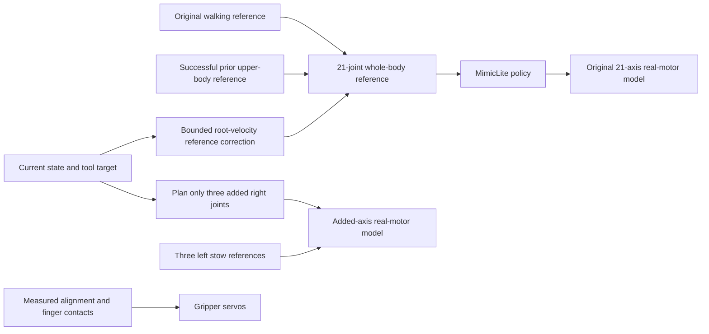

# Mini3 carrying with MimicLite controlling every original joint

`mini3_pick_carry_policy.py` is a separate entry point. The existing Sonic 5200 MimicLite policy controls all **21 original robot joints**, including both shoulders and original `elbow_pitch` joints. Independent trajectory control applies only to the **six added joints**: the right forearm twist and wrist roll/pitch use a three-joint planner, while the left added joints remain stowed. Gripper opening still uses its separate position servos.

The new version reuses upper-body references from the successful earlier task, raising the arm during the approach and beginning placement while approaching the basket. `mini3_pick_carry_7dof.py` remains available. See the [V1 backup](../outputs/task_versions/mini3_pick_carry_v1_50mm/BACKUP.md) for its complete snapshot.

By default, each launch generates a wider pickup table, independently randomizes the three cube positions and yaw angles, and uniformly selects a red, green, or blue grasp target. The terminal and viewer show the selected color. The current controller also fixes the reference-position jump when approaching walking ends and smooths tool-target frame changes. Three randomized regression episodes covering all colors completed in **23.80–24.08 s of simulation time**. The older **26.30 s** fixed-layout result predates this transition fix and is retained below as historical evidence, not a measurement of the current code or a randomized success rate.

## Running and comparison

Open the lightweight `mujoco_viewer` from the repository root; each launch uses a fresh random seed:

```bash
cd /home/carrot/Desktop/robot/MimicLite
active-adaptation/venv/mjlab/.venv/bin/python mini3_pick_carry_policy.py --start-paused
```

Press **P** to start/pause, **F** to restore following, **F8** for overview, **F9** for head RGB, **F10 / F11** for left/right gripper RGB, and **Esc** to exit. Left-drag rotates, right-drag pans, and the wheel zooms. The window reuses `mini3_task_viewer.py`, including the MuJoCo 3.11 / `mujoco_viewer 0.1.4` mouse compatibility fix. Rendering uses a separate model and data, so mouse interactions do not perturb the main physics simulation.

Reproduce a layout and its randomly selected target with an explicit seed:

```bash
active-adaptation/venv/mjlab/.venv/bin/python mini3_pick_carry_policy.py \
  --seed 42 --start-paused --output outputs/mini3_random_seed42
```

Add `--target red`, `--target green`, or `--target blue` to choose the target while keeping all three sampled cube poses unchanged for the same seed. The viewer's persistent upper-right panel displays the target color in English. To replay the original fixed blue-target layout:

```bash
active-adaptation/venv/mjlab/.venv/bin/python mini3_pick_carry_policy.py \
  --fixed-layout --start-paused --output outputs/mini3_policy_fixed_compare
```

Run a randomized episode headless into a separate output directory:

```bash
active-adaptation/venv/mjlab/.venv/bin/python mini3_pick_carry_policy.py \
  --headless --seed 42 --output outputs/mini3_random_seed42_headless
```

Run the preserved V1 with separate output for comparison:

```bash
active-adaptation/venv/mjlab/.venv/bin/python mini3_pick_carry_7dof.py \
  --start-paused --output outputs/mini3_pick_carry_v1_compare
```

| New entry-point option | Meaning |
| --- | --- |
| `--reference` | Successful source recording; defaults to `validated_run/trajectory.npz` in the V1 backup, with `report.json` alongside it |
| `--policy` | Custom ONNX or companion YAML; defaults to the trained Sonic 5200 policy |
| `--motion` | Walking reference; defaults to `Neutral_walk_forward_005__A057.npz` |
| `--seed` | Nonnegative random seed; omitted means a fresh seed, recorded in `episode.json` |
| `--target random` | Uniformly choose red, green, or blue; override with `red`, `green`, or `blue` |
| `--fixed-layout` | Use the original table and unperturbed blue-target layout; bypass randomization |
| `--approach-overlap` | Start the arm-reference transition before completing approach; defaults to 6 s for randomized runs, 3 s with `--fixed-layout` |
| `--basket-overlap 0.6` | Start the placement reference 0.6 s before completing loaded walking |
| `--arm-source command` | Default: use recorded right-arm target angles as policy references; `actual` selects recorded measured angles |
| `--arm-reference-bias` | Four original right-arm reference offsets, ordered shoulder pitch/roll/yaw and elbow pitch; all default to 0 and modify reference inputs only |
| `--extra-mode planned` | Default: plan the three added right-arm joints online; `reference` directly tracks their recording for diagnosis |
| `--gate-timeout 3.0` | Maximum continuous wait for a measured horizontal-alignment, grasp, lift, or release condition |
| `--duration 45` | Maximum simulated seconds; expiration saves the failure reason |
| `--output` | Defaults to `outputs/mini3_pick_carry_randomized`, or `outputs/mini3_pick_carry_policy` with `--fixed-layout` |

`--headless` cannot be combined with `--start-paused`. `--fixed-layout` cannot select red or green; its seed has no effect. Reusing an output directory replaces that directory's episode and run records, so choose distinct directories to retain multiple trials. Changing reference offsets, the scene, or overlap settings requires new grasp and collision checks.

## Control ownership



`mini3_policy_task_reference.py` extracts the right-arm reference and added-joint trajectory from the saved successful task, and reconstructs the original walking reference. Locomotion uses the original reference clip so that recorded body tracking errors do not become new targets. The four original right-arm joints are mapped by name into the whole-body reference. Online four-joint or seven-joint IK no longer supplies their actuator targets.

The original 21-axis path is `policy.step()` → `q / dq / effort / kp / kd` → the original real-motor model. All five outputs reach the motor model unchanged. Arm IK does not replace position or velocity targets, feedforward effort, or gains. Motor current response, delay, torque-speed limits, and original actuator clipping remain active. The report records `policy_output_override_max` and `policy_output_checks` for this interface; the trajectory also records `policy_command` and `motor_command`.

Pickup and placement in both randomized and fixed layouts add closed-loop correction to the policy's reference inputs. Each XY root-velocity correction is `clip(30 × position_error, -0.12, 0.12)` m/s, smoothed with a first-order update using **alpha=0.1**. The correction updates future reference positions and linear velocities; the policy computes the resulting original-joint commands, and its outputs still pass through unchanged.

MimicLite is a tracking policy and still needs motion references. This version conditions it on upper-body motion obtained by the earlier task; the network does not infer the grasping objective from RGB, and the policy has not been retrained.

Added joints remain the left/right `elbow_yaw_joint`, `wrist_roll_joint`, and `wrist_pitch_joint`. The right three-joint planner starts from measured state and balances finger-pad position, orientation, continuity, and collision clearance. The left side stays stowed. Its online optimization variables contain only the three added right joints. Candidate kinematics run in separate `MjData`, keeping original joints at their measured angles; candidate held-object poses are also used only in that copy for collision evaluation. Cube poses are sampled once at initialization; during the task the main simulation does not reset arm or object poses and does not weld the object to the hand.

The final three-joint planner uses position residual weight **20**, orientation residual weight **3.0**, a clearance target of **8 mm** with residual weight **30**, and an additional **5 mm** of tool-target height during manipulation. The orientation constraint helps keep the gripper horizontal and clear of the tabletop. All four original right-arm reference offsets remain **0** in the final run; no joint calibration bias was used.

Added axes retain the original `elbow_pitch` 4310P motor characteristics, including the current loop and torque limits, with position gains **kp=20, kd=0.4**. Their references change by at most 0.03 rad per 20 ms. Bounded integral correction and bias-torque feedforward apply only to added joints. Gripper opening uses the cube's projected half-width in the pad frame, maintaining 2 mm of position preload per side during closing and transport.

## Shorter waits and overlapping motion

| Change | V1 | New default |
| --- | --- | --- |
| Explicit standing wait after approaching the cube | 2.0 s | 0 s |
| Explicit wait after lifting | 0.5 s | 0 s |
| Explicit standing wait at the basket | 1.0 s | 0 s |
| Arm raising overlapping approach walking | None | Begin 6.0 s early for randomized runs, 3.0 s for fixed layout |
| Placement overlapping loaded walking | None | Begin placement reference 0.6 s early |

`body_source_time` and `arm_source_time` advance the body and arm references independently. Active recorded motions retain their original 1× playback rate; savings come from removing explicit waits and performing motions concurrently. A 0.5 s smooth blend connects walking arm posture to the manipulation reference. Short settling tails inside active recorded segments are not globally compressed. Actual policy tracking speeds still depend on state and motor dynamics.

The reconstructed root reference now chains each segment to the previous reference endpoint: pickup standing holds the final approach pose, loaded walking starts at that same XY position, and basket standing holds the final carry pose. Recorded measured root XY values are no longer substituted at these boundaries. Previously, this substitution introduced a **15.101 cm** forward step between **6.46 and 6.48 s**, which became a spurious **7.55 m/s** target velocity; the policy also observed the discontinuity through its future-reference window. The fix removes that position jump without modifying original walking samples or adding a standing delay. It does not make the entire sampled motion strictly C1/C2 continuous: the original clip still contains ordinary velocity changes at its endpoints.

At `REACH`, `CARRY`, and `PLACE`, the added-joint tool target transitions between its moving-base and world-anchored definitions over **0.4 s**. A quintic blend removes the initial position and orientation offsets relative to the preceding target, so changing the target's coordinate frame does not introduce another abrupt command. This blend runs concurrently with the active motion and adds no fixed wait. Original 21-axis policy outputs continue to pass through unchanged.

Early arm motion first follows the clearance path around the hip and table legs; it does not attempt to grasp while the robot is still far away. Measured conditions continue to gate grasping and release:

1. Both randomized and fixed-layout runs check horizontal alignment **0.6 s** into `LOWER`. In each horizontal pad-frame direction, the cube-center offset plus its projected half-extent must be below **33 mm**. If this is unmet, the reference clock and its future frames are held while the policy follows the root-velocity correction; descent resumes after alignment. This wait is recorded as `ALIGN` and shares the default **3 s** continuous timeout.
2. Closing starts only when the actual cube envelope fits between the finger pads, vertical error is below **10 mm**, and the palm is approximately horizontal.
3. The lift reference proceeds after at least 1 s of closing and opposing finger contact forces above 0.1 N.
4. Loaded walking is permitted after the cube rises at least 8 cm above its initial position while retaining opposing contacts; sustained contact loss stops the task.
5. The gripper opens after the cube footprint is safely inside the basket and its bottom is above the rim. Success requires the cube to settle inside.

If a condition is unmet, the reference clock holds at its gate while physics and policy inference continue. These waits respond to measured grasp state rather than the removed fixed standing delays.

## Scene, perception, and collisions

The source scene is `any4hdmi/assets/robots/mini3_mjlab/scene_pick_carry_7dof.xml`. Default runs save their generated scene as `episode_scene.xml` in the output directory. The pickup tabletop grows from **34 × 10 cm** to **40 × 16 cm**, keeping the approach-facing edges in place; its height stays **50 cm**. The basket and its table stay fixed. Both added forearm links remain **50 mm** long. Root rotation follows the forearm longitudinal axis and keeps the connection straight; wrist roll/pitch are at the gripper root.

`mini3_randomized_task.py` independently samples each cube's X and Y offset within **±1.2 cm** of its original position and yaw within **±12°**. Roll and pitch remain zero so the cubes lie flat. The sampling regions preserve space between the cubes and keep their rotated footprints on the tabletop. Color identities retain their own regions; selecting another color changes the pickup location. Target selection is uniform among the three colors and independent of cube placement. Both body defaults and the `home` keyframe contain the sampled poses.

The robot starts approximately **3 m** before its selected pickup point. The route translates to the selected cube, then smoothly removes that translation during carrying to reach the unchanged basket. Randomized robot initialization also applies an XY alignment offset of **(+2.7, +2.0) cm**, so the running task's initial separation is approximate rather than exactly 3 m; fixed-layout replay has no such offset. Original arm joint references still go through MimicLite; selecting a target does not enable direct control of those joints.

During lowering and closing in both randomized and fixed layouts, the added-joint tool target blends toward the selected cube's actual XY center. Only randomized runs enable early closing: in the last **0.9 s** before the recorded closing stage, the gripper may begin closing as soon as measured alignment passes the existing envelope, height, and tilt checks. This allows it to use a brief alignment window while retaining the same grasp conditions.

During `PLACE` in both layout modes, the actual held cube position is transformed into the basket frame. Its XY position is guided into the **±5 cm** region around the basket center using both the added-joint tool target and the policy's root-velocity reference correction. The original release conditions still check the rotated cube's whole footprint and height above the basket rim; the ±5 cm steering region does not replace those conditions.

This version still reads true MuJoCo robot, cube, and basket poses for tool planning and grasp/release decisions. RGB cameras provide observation views only, without object detection or visual localization. This is a simulation example using privileged state.

Tool targets, finger-contact checks, collision classification, lift checks, and basket-success checks all use the selected cube. Allowed grasp contact applies to the right fingers and that cube; other cubes and the added links/gripper remain covered by collision checks. The inherited arm contact monitor checks actual contacts every 2 ms and immediately stops for unexpected penetration exceeding 2 mm. Shallower unexpected contacts are recorded too, so `success=true` alone does not establish collision-free operation. Independently audit saved frames against the same generated scene, keeping `report.json` beside the trajectory so the audit can read the selected target:

```bash
active-adaptation/venv/mjlab/.venv/bin/python audit_mini3_arm_collisions.py \
  --trajectory outputs/mini3_pick_carry_randomized/trajectory.npz \
  --scene outputs/mini3_pick_carry_randomized/episode_scene.xml \
  --output outputs/mini3_pick_carry_randomized/arm_collision_audit.json
```

The offline audit covers recorded frames and model collision geometry; per-physics-step monitoring adds actual contact information between those frames. Review both alongside the task outcome.

## Records and validation

Output includes `report.json`, `trajectory.npz`, `task_reference.json`, and `task_reference.npz`. Randomized runs additionally save `episode_scene.xml` and `episode.json`, including the actual seed, selected color/body, cube positions and quaternions, sampling bounds, tabletop dimensions, and pickup translation. Records include policy commands, added-joint targets, actual motion, opposing finger forces, body/arm source clocks, measured gate waits, and the source recording path and SHA-256. Collision auditing produces a separate report.

After the stopping-transition fix, the following headless episodes completed physical grasping, loaded walking, and stable placement. All five original 21-axis policy command arrays still pass through unchanged:

| Seed / layout | Selected target | Simulation time | Report |
| --- | --- | --- | --- |
| `135234108456803991980513049915416696092` | Green | 24.00 s | [Report](../outputs/mini3_transition_fix/user_seed_v1/report.json) |
| `42` | Blue | 24.08 s | [Report](../outputs/mini3_transition_fix/seed42_v1/report.json) |
| `2` | Red | 23.80 s | [Report](../outputs/mini3_transition_fix/seed2_v1/report.json) |
| Fixed layout | Blue | 26.58 s | [Report](../outputs/mini3_transition_fix/fixed_v2/report.json) |

The fixed-layout run waited **0.30 s** for measured horizontal alignment; its other gate waits were zero. Its **13290** physics-step collision checks recorded no unexpected contacts. The [actual lightweight viewer run](../outputs/mini3_transition_fix/user_seed_viewer/report.json) of the green seed also succeeded in **24.00 s**; all **15 trajectory arrays across 1200 frames** exactly match its headless counterpart, as recorded in the [viewer comparison](../outputs/mini3_transition_fix/viewer_comparison.json). The Mini3 regression suite passed **116 tests**, including reference continuity and target-frame transition checks.

The [same-seed stopping comparison](../outputs/mini3_transition_fix/stopping_comparison.json) uses the green layout above and only the interval **6.3 ≤ t < 6.8 s**. The maximum per-tick leg target-angle change decreased from **0.368974 to 0.014883 rad (95.97%)**, and peak measured base angular speed decreased from **1.28532 to 0.143404 rad/s (88.84%)**. These are stopping-window metrics, not whole-task maxima. The old comparison run was manually stopped at 11.36 s, after that interval; its original artifacts are preserved in `outputs/mini3_transition_fix/before/`.

At 500 Hz, green recorded a forearm contact against the non-target blue cube with maximum penetration **0.0403 mm**, blue recorded no unexpected contact, and red's maximum unexpected penetration was **0.3703 mm**. The independent [green saved-frame audit](../outputs/mini3_transition_fix/user_seed_v1/arm_collision_audit.json) covers **1200 frames × 345 geometry pairs** without unexpected penetration. Its 50 Hz sampling does not exclude the shallower contact found between frames by the physics-step monitor. These checks do not establish success or collision-free operation for every random seed.

The following five headless checks on 2026-09-18 are historical runs **before the stopping-transition fix**. They completed physical grasping, loaded walking, and stable placement inside the basket; override of all five original 21-axis policy command arrays remained **0**:

| Seed / target option | Selected target | Simulation time | Report |
| --- | --- | --- | --- |
| `0`, random | Green | 24.06 s | [Report](../outputs/randomized_validation/place_seed_0/report.json) |
| `1 --target blue` | Blue | 24.20 s | [Report](../outputs/randomized_validation/place_seed_1_blue/report.json) |
| `2`, random | Red | 23.88 s | [Report](../outputs/randomized_validation/place_seed_2/report.json) |
| `3`, random | Red | 24.14 s | [Report](../outputs/randomized_validation/final_seed_3/report.json) |
| `42`, random | Blue | 23.78 s | [Report](../outputs/randomized_validation/final_seed_42/report.json) |

An [actual lightweight viewer run](../outputs/randomized_validation/viewer_seed_0/report.json) of seed 0 also succeeded. All 15 trajectory arrays across 1203 frames exactly match its headless counterpart. The [viewer inspection image](../outputs/randomized_validation/viewer_seed_0/viewer_frame.png) captures a saved lowering pose through the actual `mujoco_viewer` framebuffer, showing the wider table and upper-right target label.

These runs were not all contact-free: the 500 Hz monitor recorded no unexpected contact for blue seed 1, while other runs included palm–target or finger–non-target contacts. Maximum unexpected penetration was approximately **0.60 mm** (seed 3), below the 2 mm stop threshold. Independent audits for [green](../outputs/randomized_validation/place_seed_0/arm_collision_audit.json), [blue](../outputs/randomized_validation/place_seed_1_blue/arm_collision_audit.json), and [red](../outputs/randomized_validation/place_seed_2/arm_collision_audit.json) cover their full trajectories and 345 geometry pairs per frame, with no unexpected contacts hidden by collision filters. The 50 Hz saved-frame audit does not replace 500 Hz physics-step monitoring. These finite checks do not establish success for every random seed.

The historical fixed-layout [lightweight viewer report](../outputs/mini3_pick_carry_policy/report.json) and [headless report](../outputs/mini3_policy_v2_horizontal/report.json) both record `SUCCESS`, with the blue cube settled inside the basket. They predate the stopping-transition fix; `--fixed-layout` retains their scene, while the current controller also applies the corrected transitions, cube centering, alignment gate, and placement feedback. Each old run contains **1315 frames**, and all **15 trajectory arrays are exactly equal element by element**; see the [comparison](../outputs/mini3_pick_carry_policy/trajectory_comparison_with_headless.json).

| Historical fixed-layout measured quantity | Result |
| --- | --- |
| Complete simulated task duration | 26.30 s, compared with 32.86 s for V1 |
| Maximum override difference across the five original policy outputs | `policy_output_override_max=0`, checked 13150 times |
| Actual contact monitoring every 2 ms | 13150 checks, empty unexpected-contact list |
| Independent collision audit | 1315 frames × 345 geometry pairs, zero unexpected or filtered unexpected pairs |
| Additional grasp, lift, carry, and release gate waits | All 0 s; original closing and lifting motion durations remain |
| Real motors / pelvis support / object welds | Enabled / disabled / disabled |

The [independent collision report](../outputs/mini3_policy_v2_horizontal/arm_collision_audit.json) audits the complete saved trajectory and records zero maximum unexpected penetration. Normal finger–target contact and required mechanical interfaces follow the existing rules; scene collision filtering was not changed to complete the task.

The [motion-overlap audit](../outputs/mini3_policy_v2_horizontal/overlap_motion_audit.json) measures **0.965 m** of forward base travel during the **3.48–6.48 s** approach overlap. Base speed exceeds 0.1 m/s while the original right-arm joint-speed vector norm exceeds 0.1 rad/s for **1.96 s** in total. At **6.44 s**, the grasp center is **46.2 mm** higher relative to the base while the base still moves at **0.210 m/s**. Earlier overlap is primarily outward clearance and arm rotation; most vertical raising occurs later during approach deceleration, rather than continuously throughout all 3 s.

These results describe the saved fixed-scene runs and the stated collision-audit scope. They do not establish randomized-scene success rates or RGB-based autonomous manipulation.

## Recovering the earlier source snapshot

The complete V1 archive is `outputs/task_versions/mini3_pick_carry_v1_50mm/source_8839bb9.tar.gz`, from commit `8839bb9b35ed88bb605d12245b284bc5e978b78f`. Use the preserved V1 entry point for normal comparison. To extract original source, use a new empty directory:

```bash
mkdir -p outputs/task_versions/mini3_pick_carry_v1_restore
tar -xzf outputs/task_versions/mini3_pick_carry_v1_50mm/source_8839bb9.tar.gz \
  -C outputs/task_versions/mini3_pick_carry_v1_restore
```

Extraction leaves the current project intact. The backup documents original ONNX/checkpoint locations and hashes, saved small motion/configuration files, and environment information. The archive does not duplicate the Python environment or large weights; an independent restored run must configure those external dependencies from the recorded information.
