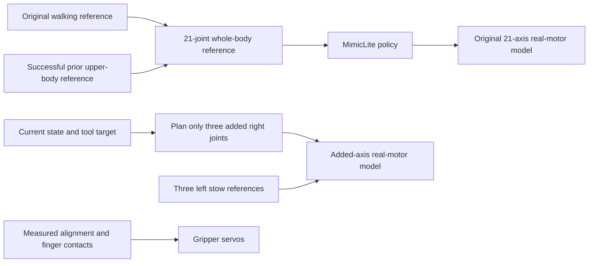

# Mini3 carrying with MimicLite controlling every original joint

`mini3_pick_carry_policy.py` is a separate entry point. The existing Sonic 5200 MimicLite policy controls all **21 original robot joints**, including both shoulders and original `elbow_pitch` joints. Independent trajectory control applies only to the **six added joints**: the right forearm twist and wrist roll/pitch use a three-joint planner, while the left added joints remain stowed. Gripper opening still uses its separate position servos.

The new version reuses upper-body references from the successful earlier task, raising the arm during the approach and beginning placement while approaching the basket. `mini3_pick_carry_7dof.py` remains available. See the [V1 backup](../outputs/task_versions/mini3_pick_carry_v1_50mm/BACKUP.md) for its complete snapshot.

The final version completes grasping, loaded walking, and basket placement in **26.30 s of simulation time**, both headless and in an actual `mujoco_viewer` window. This is **6.56 s, approximately 20%, shorter** than V1's **32.86 s**. Per-physics-step contact monitoring and the independent saved-frame audit found no unexpected arm collisions.

## Running and comparison

Open the lightweight `mujoco_viewer` from the repository root:

```bash
cd /home/carrot/Desktop/robot/MimicLite
active-adaptation/venv/mjlab/.venv/bin/python mini3_pick_carry_policy.py --start-paused
```

Press **P** to start/pause, **F** to restore following, **F8** for overview, **F9** for head RGB, **F10 / F11** for left/right gripper RGB, and **Esc** to exit. Left-drag rotates, right-drag pans, and the wheel zooms. The window reuses `mini3_task_viewer.py`, including the MuJoCo 3.11 / `mujoco_viewer 0.1.4` mouse compatibility fix. Rendering uses a separate model and data, so mouse interactions do not perturb the main physics simulation.

Run headless into a separate output directory:

```bash
active-adaptation/venv/mjlab/.venv/bin/python mini3_pick_carry_policy.py \
  --headless --output outputs/mini3_pick_carry_policy_headless
```

Run the preserved V1 with separate output for comparison:

```bash
active-adaptation/venv/mjlab/.venv/bin/python mini3_pick_carry_7dof.py \
  --start-paused --output outputs/mini3_pick_carry_v1_compare
```

| New entry-point option | Meaning |
| --- | --- |
| `--reference` | Successful source recording; defaults to `validated_run/trajectory.npz` in the V1 backup, with `report.json` alongside it |
| `--policy` | Custom ONNX or companion YAML; defaults to the trained Sonic 5200 policy |
| `--motion` | Walking reference; defaults to `Neutral_walk_forward_005__A057.npz` |
| `--approach-overlap 3.0` | Start the arm-reference transition 3 s before completing the approach |
| `--basket-overlap 0.6` | Start the placement reference 0.6 s before completing loaded walking |
| `--arm-source command` | Default: use recorded right-arm target angles as policy references; `actual` selects recorded measured angles |
| `--arm-reference-bias` | Four original right-arm reference offsets, ordered shoulder pitch/roll/yaw and elbow pitch; all default to 0 and modify reference inputs only |
| `--extra-mode planned` | Default: plan the three added right-arm joints online; `reference` directly tracks their recording for diagnosis |
| `--gate-timeout 3.0` | Maximum continuous wait for a measured grasp, lift, or release condition |
| `--duration 45` | Maximum simulated seconds; expiration saves the failure reason |
| `--output` | Defaults to `outputs/mini3_pick_carry_policy` |

`--headless` cannot be combined with `--start-paused`. Changing reference offsets, the scene, or overlap settings requires new grasp and collision checks.

## Control ownership



`mini3_policy_task_reference.py` extracts the right-arm reference and added-joint trajectory from the saved successful task, and reconstructs the original walking reference. Locomotion uses the original reference clip so that recorded body tracking errors do not become new targets. The four original right-arm joints are mapped by name into the whole-body reference. Online four-joint or seven-joint IK no longer supplies their actuator targets.

The original 21-axis path is `policy.step()` → `q / dq / effort / kp / kd` → the original real-motor model. All five outputs reach the motor model unchanged. Arm IK does not replace position or velocity targets, feedforward effort, or gains. Motor current response, delay, torque-speed limits, and original actuator clipping remain active. The report records `policy_output_override_max` and `policy_output_checks` for this interface; the trajectory also records `policy_command` and `motor_command`.

MimicLite is a tracking policy and still needs motion references. This version conditions it on upper-body motion obtained by the earlier task; the network does not infer the grasping objective from RGB, and the policy has not been retrained.

Added joints remain the left/right `elbow_yaw_joint`, `wrist_roll_joint`, and `wrist_pitch_joint`. The right three-joint planner starts from measured state and balances finger-pad position, orientation, continuity, and collision clearance. The left side stays stowed. Its online optimization variables contain only the three added right joints. Candidate kinematics run in separate `MjData`, keeping original joints at their measured angles; candidate held-object poses are also used only in that copy for collision evaluation. The main simulation does not reset arm or object poses and does not weld the object to the hand.

The final three-joint planner uses position residual weight **20**, orientation residual weight **3.0**, a clearance target of **8 mm** with residual weight **30**, and an additional **5 mm** of tool-target height during manipulation. The orientation constraint helps keep the gripper horizontal and clear of the tabletop. All four original right-arm reference offsets remain **0** in the final run; no joint calibration bias was used.

Added axes retain the original `elbow_pitch` 4310P motor characteristics, including the current loop and torque limits, with position gains **kp=20, kd=0.4**. Their references change by at most 0.03 rad per 20 ms. Bounded integral correction and bias-torque feedforward apply only to added joints. Gripper opening uses the cube's projected half-width in the pad frame, maintaining 2 mm of position preload per side during closing and transport.

## Shorter waits and overlapping motion

| Change | V1 | New default |
| --- | --- | --- |
| Explicit standing wait after approaching the cube | 2.0 s | 0 s |
| Explicit wait after lifting | 0.5 s | 0 s |
| Explicit standing wait at the basket | 1.0 s | 0 s |
| Arm raising overlapping approach walking | None | Begin reference transition 3.0 s early |
| Placement overlapping loaded walking | None | Begin placement reference 0.6 s early |

`body_source_time` and `arm_source_time` advance the body and arm references independently. Active recorded motions retain their original 1× playback rate; savings come from removing explicit waits and performing motions concurrently. A 0.5 s smooth blend connects walking arm posture to the manipulation reference. Short settling tails inside active recorded segments are not globally compressed. Actual policy tracking speeds still depend on state and motor dynamics.

Early arm motion first follows the clearance path around the hip and table legs; it does not attempt to grasp while the robot is still far away. Measured conditions continue to gate grasping and release:

1. Closing starts only when the actual cube envelope fits between the finger pads and the palm is approximately horizontal.
2. The lift reference proceeds after at least 1 s of closing and opposing finger contact forces above 0.1 N.
3. Loaded walking is permitted after the cube rises at least 8 cm above its initial position while retaining opposing contacts; sustained contact loss stops the task.
4. The gripper opens after the cube footprint is safely inside the basket and its bottom is above the rim. Success requires the cube to settle inside.

If a condition is unmet, the reference clock holds at its gate while physics and policy inference continue. These waits respond to measured grasp state rather than the removed fixed standing delays.

## Scene, perception, and collisions

The scene remains `any4hdmi/assets/robots/mini3_mjlab/scene_pick_carry_7dof.xml`: initial forward separation from the blue cube is **3 m**, tables are **0.5 m** high, and both added forearm links are **50 mm** long. Root rotation follows the forearm longitudinal axis and keeps the connection straight; wrist roll/pitch are at the gripper root. The three cubes, basket, link collisions, and gripper collisions are retained.

This version still reads true MuJoCo robot, cube, and basket poses for tool planning and grasp/release decisions. RGB cameras provide observation views only, without object detection or visual localization. This is a simulation example using privileged state.

The inherited arm contact monitor checks actual contacts every 2 ms and immediately stops for unexpected penetration exceeding 2 mm. Shallower unexpected contacts are recorded too, so `success=true` alone does not establish collision-free operation. Independently audit saved frames with:

```bash
active-adaptation/venv/mjlab/.venv/bin/python audit_mini3_arm_collisions.py \
  --trajectory outputs/mini3_pick_carry_policy/trajectory.npz \
  --scene any4hdmi/assets/robots/mini3_mjlab/scene_pick_carry_7dof.xml \
  --output outputs/mini3_pick_carry_policy/arm_collision_audit.json
```

The offline audit covers recorded frames and model collision geometry; per-physics-step monitoring adds actual contact information between those frames. Review both alongside the task outcome.

## Records and validation

New output includes `report.json`, `trajectory.npz`, `task_reference.json`, and `task_reference.npz`. Records include policy commands, added-joint targets, actual motion, opposing finger forces, body/arm source clocks, measured gate waits, and the source recording path and SHA-256. Collision auditing produces a separate report.

The final [lightweight viewer report](../outputs/mini3_pick_carry_policy/report.json) and [headless report](../outputs/mini3_policy_v2_horizontal/report.json) both record `SUCCESS`, with the blue cube settled inside the basket. Each run contains **1315 frames**, and all **15 trajectory arrays are exactly equal element by element**; see the [comparison](../outputs/mini3_pick_carry_policy/trajectory_comparison_with_headless.json).

| Final measured quantity | Result |
| --- | --- |
| Complete simulated task duration | 26.30 s, compared with 32.86 s for V1 |
| Maximum override difference across the five original policy outputs | `policy_output_override_max=0`, checked 13150 times |
| Actual contact monitoring every 2 ms | 13150 checks, empty unexpected-contact list |
| Independent collision audit | 1315 frames × 345 geometry pairs, zero unexpected or filtered unexpected pairs |
| Additional grasp, lift, carry, and release gate waits | All 0 s; original closing and lifting motion durations remain |
| Real motors / pelvis support / object welds | Enabled / disabled / disabled |

The [independent collision report](../outputs/mini3_policy_v2_horizontal/arm_collision_audit.json) audits the complete saved trajectory and records zero maximum unexpected penetration. Normal finger–target contact and required mechanical interfaces follow the existing rules; scene collision filtering was not changed to complete the task.

The [motion-overlap audit](../outputs/mini3_policy_v2_horizontal/overlap_motion_audit.json) measures **0.965 m** of forward base travel during the **3.48–6.48 s** approach overlap. Base speed exceeds 0.1 m/s while the original right-arm joint-speed vector norm exceeds 0.1 rad/s for **1.96 s** in total. At **6.44 s**, the grasp center is **46.2 mm** higher relative to the base while the base still moves at **0.210 m/s**. Earlier overlap is primarily outward clearance and arm rotation; most vertical raising occurs later during approach deceleration, rather than continuously throughout all 3 s.

These results describe the saved fixed-scene runs and the stated collision-audit scope. They do not establish randomized-scene success rates or RGB-based autonomous manipulation.

## Recovering the earlier source snapshot

The complete V1 archive is `outputs/task_versions/mini3_pick_carry_v1_50mm/source_8839bb9.tar.gz`, from commit `8839bb9b35ed88bb605d12245b284bc5e978b78f`. Use the preserved V1 entry point for normal comparison. To extract original source, use a new empty directory:

```bash
mkdir -p outputs/task_versions/mini3_pick_carry_v1_restore
tar -xzf outputs/task_versions/mini3_pick_carry_v1_50mm/source_8839bb9.tar.gz \
  -C outputs/task_versions/mini3_pick_carry_v1_restore
```

Extraction leaves the current project intact. The backup documents original ONNX/checkpoint locations and hashes, saved small motion/configuration files, and environment information. The archive does not duplicate the Python environment or large weights; an independent restored run must configure those external dependencies from the recorded information.
