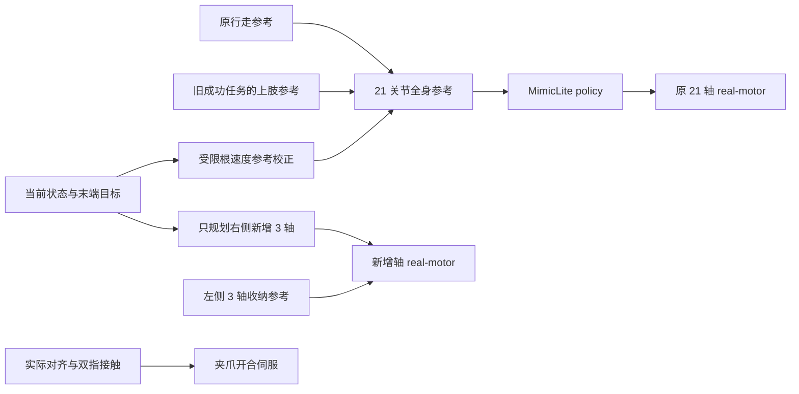

# Mini3：原生关节由 MimicLite 控制的搬运任务

`mini3_pick_carry_policy.py` 是独立的新入口。原机器人全部 **21 个关节**，包括左右肩部和原 `elbow_pitch`，都由已有 Sonic 5200 MimicLite policy 输出控制。只有双侧新增的 **6 个关节**使用独立轨迹控制：右侧根部自转、腕 roll/pitch 使用三关节规划，左侧保持收纳。夹爪开合仍由独立位置伺服控制。

新版本复用旧成功任务的上肢参考动作，在接近方块时就开始抬手，并在接近篮子时提前开始放置动作。原版 `mini3_pick_carry_7dof.py` 保留，完整备份见 [V1 备份说明](../outputs/task_versions/mini3_pick_carry_v1_50mm/BACKUP.md)。

默认每次启动都会生成更宽的取物桌面，独立随机化三个方块的位置和水平朝向，并在红、绿、蓝三个方块中等概率指定抓取目标。终端和窗口会显示目标颜色。当前控制器还修复了接近结束时的参考位置跳变，并平滑衔接末端目标坐标系切换。三组覆盖全部颜色的随机复验用 **23.80–24.08 s 仿真时间**完成。原 **26.30 s** 固定布局结果来自本次停步过渡修复之前，以下仅保留为历史记录，不作为当前代码指标或随机场景成功率。

## 运行与对比

在工程根目录打开轻量 `mujoco_viewer` 窗口；每次启动使用新随机种子：

```bash
cd /home/carrot/Desktop/robot/MimicLite
active-adaptation/venv/mjlab/.venv/bin/python mini3_pick_carry_policy.py --start-paused
```

按 **P** 开始/暂停，**F** 恢复跟随，**F8** 总览、**F9** 头部 RGB、**F10 / F11** 左右夹爪 RGB，**Esc** 退出。鼠标左键拖拽旋转、右键平移、滚轮缩放。窗口沿用 `mini3_task_viewer.py`，保留 MuJoCo 3.11 与 `mujoco_viewer 0.1.4` 的鼠标接口兼容修复；显示使用独立模型和数据，鼠标操作不会向主物理仿真施加扰动。

指定种子以复现同一布局及其随机目标：

```bash
active-adaptation/venv/mjlab/.venv/bin/python mini3_pick_carry_policy.py \
  --seed 42 --start-paused --output outputs/mini3_random_seed42
```

添加 `--target red`、`--target green` 或 `--target blue` 可指定目标；同一个种子下三个方块的随机位姿不受目标选项影响。窗口右上角的常驻栏用英文显示目标颜色。复现原来的固定蓝块布局：

```bash
active-adaptation/venv/mjlab/.venv/bin/python mini3_pick_carry_policy.py \
  --fixed-layout --start-paused --output outputs/mini3_policy_fixed_compare
```

无窗口运行随机场景并保存新目录：

```bash
active-adaptation/venv/mjlab/.venv/bin/python mini3_pick_carry_policy.py \
  --headless --seed 42 --output outputs/mini3_random_seed42_headless
```

运行保留的 V1，使用单独输出以方便比较：

```bash
active-adaptation/venv/mjlab/.venv/bin/python mini3_pick_carry_7dof.py \
  --start-paused --output outputs/mini3_pick_carry_v1_compare
```

| 新版参数 | 含义 |
| --- | --- |
| `--reference` | 旧成功轨迹；默认读取 V1 备份中的 `validated_run/trajectory.npz`，同目录需有 `report.json` |
| `--policy` | 自定义 ONNX 或同名 YAML；默认使用已训练 Sonic 5200 |
| `--motion` | 行走参考动作；默认 `Neutral_walk_forward_005__A057.npz` |
| `--seed` | 非负随机种子；不填则生成新种子，实际值记录在 `episode.json` |
| `--target random` | 默认在红、绿、蓝中等概率抽取；可指定 `red`、`green` 或 `blue` |
| `--fixed-layout` | 使用原桌面及未扰动的固定蓝块布局，跳过随机化 |
| `--approach-overlap` | 接近结束前开始上肢参考过渡；随机场景默认提前 6 s，`--fixed-layout` 提前 3 s |
| `--basket-overlap 0.6` | 到达篮子前提前 0.6 s 开始放置参考 |
| `--arm-source command` | 默认把旧记录的右臂目标角作为 policy 参考；`actual` 改用旧实测角度 |
| `--arm-reference-bias` | 四个原右臂参考角的偏置，顺序为肩 pitch/roll/yaw、肘 pitch；默认全部为 0，只修改输入参考 |
| `--extra-mode planned` | 默认在线规划右侧新增三轴；`reference` 为直接跟踪新增轴记录的诊断模式 |
| `--gate-timeout 3.0` | 实测水平对齐、抓取、抬起或释放条件持续未满足时的等待上限 |
| `--duration 45` | 最大仿真秒数；超时保存失败原因 |
| `--output` | 默认 `outputs/mini3_pick_carry_randomized`；使用 `--fixed-layout` 时为 `outputs/mini3_pick_carry_policy` |

`--headless` 不能与 `--start-paused` 同时使用。`--fixed-layout` 不能指定红块或绿块，其随机种子不生效。复用输出目录会覆盖该目录的场景与运行记录；保留多次测试时应指定不同目录。改变参考偏置、场景或交叠时间后，需要重新检查抓取和碰撞结果。

## 控制分工



`mini3_policy_task_reference.py` 从保存的成功任务提取右臂上肢参考与新增轴轨迹，并重建原行走参考。行走部分使用原参考动作，避免把旧运行的身体跟踪误差再次作为目标。右侧原四关节按名称写入全身参考；它们不再由在线四关节或七关节 IK 输出执行目标。

原 21 轴的控制路径为 `policy.step()` → `q / dq / effort / kp / kd` → 原 real-motor 模型。五类输出全部原样传入电机模型；没有用上肢 IK 覆盖关节目标、速度、力矩前馈或增益。电机电流响应、延迟、力矩速度约束和原执行器限幅仍然生效。报告中的 `policy_output_override_max` 和 `policy_output_checks` 用于检查这条接口，轨迹还记录 `policy_command` 与 `motor_command`。

随机和固定布局的抓取与放置均通过修改 policy 的输入参考进行闭环校正。XY 两方向的根速度校正分别为 `clip(30 × 位置误差, -0.12, 0.12)` m/s，并使用 **alpha=0.1** 的一阶更新平滑。这项校正作用于未来参考位置及线速度；原关节命令仍由 policy 计算，全部输出保持原样透传。

MimicLite 是跟踪策略，仍需要动作参考。当前版本将旧任务已经得到的上肢动作作为条件输入；这不代表网络仅凭 RGB 自主生成了抓取意图，也没有重新训练策略。

新增关节仍为双侧 `elbow_yaw_joint`、`wrist_roll_joint`、`wrist_pitch_joint`。右侧三关节规划以实际状态为起点，兼顾指垫位置、朝向、连续性和碰撞间隙；左侧保持收纳。在线优化器的变量只有右侧新增三关节。它在独立 `MjData` 上进行候选运动学计算，原关节保持实测角度；持物时的候选方块位姿也只用于该副本中的碰撞评估。方块仅在初始化时随机摆放；运行过程中主仿真没有手臂位置重设、方块位置重设或物体焊接。

最终三关节规划使用位置残差权重 **20**、朝向残差权重 **3.0**、碰撞间隙目标 **8 mm** 及其残差权重 **30**，操作阶段末端目标额外抬高 **5 mm**。朝向约束帮助夹爪保持水平，给桌面和掌部留出间隙。最终运行的四个原右臂参考偏置全部为 **0**，未使用关节校准偏置。

新增轴沿用原 `elbow_pitch` 的 4310P 电机特性，仍带真实电流环及力矩限制，位置环保持 **kp=20、kd=0.4**。新增关节参考每 20 ms 最多变化 0.03 rad，受限积分和偏置力矩前馈仅作用于新增关节。夹爪根据方块在指垫坐标系中的投影半宽计算开口，闭爪及持物时保留每侧 2 mm 的位置预压。

## 减少等待并重叠动作

| 调整 | V1 | 新版默认 |
| --- | --- | --- |
| 到达方块后的显式站立等待 | 2.0 s | 0 s |
| 抬起完成后的显式等待 | 0.5 s | 0 s |
| 到达篮子后的显式等待 | 1.0 s | 0 s |
| 抬手与接近行走交叠 | 无 | 随机场景提前 6.0 s，固定布局提前 3.0 s |
| 放置与携物行走交叠 | 无 | 提前 0.6 s 开始放置参考 |

`body_source_time` 与 `arm_source_time` 分别推进身体和上肢参考。活动轨迹按原来的 1 倍时间速度播放；缩短的部分来自删除显式等待和让动作同时进行。抬手开始时用 0.5 s 平滑混合从行走上肢姿态接入操作姿态。原活动段内部的短暂收尾不被整体时间压缩。网络实际跟踪速度仍受运动状态和电机动力学影响。

重建根参考时，各段现在按前段参考终点串接：抓取站立保持接近行走最后一帧，携物行走从同一 XY 位置开始，篮旁站立保持携物行走最后一帧，不再用旧记录的实测 root XY 覆盖这些边界。原覆盖曾在 **6.46→6.48 s** 引入向前 **15.101 cm** 的阶跃，形成约 **7.55 m/s** 的伪参考速度；policy 还会通过未来参考窗口提前看到该不连续。本次修复消除了这项位置跳变，保留原行走采样，不增加站立等待。这不表示全程轨迹达到严格 C1/C2 连续：原动作端点仍保留正常的采样速度变化。

在 `REACH`、`CARRY` 和 `PLACE` 切换时，新增关节的末端目标用 **0.4 s** 在随基座移动和世界锚定的定义间过渡。五次曲线逐渐消除相对前一个目标的位置与姿态初始偏差，避免坐标系切换再次造成命令突变。该过渡与当前动作同时进行，不增加固定停顿；原 21 轴 policy 输出仍原样透传。

提前抬手阶段先执行让手臂避开髋部和桌腿的路径；不是机器人还远离方块时直接伸爪夹取。抓取与释放继续由实测条件约束：

1. 随机和固定布局均在 `LOWER` 开始 **0.6 s** 后先检查水平对齐：指垫坐标系的两个水平方向上，方块中心偏差加投影半尺寸均需小于 **33 mm**。未对齐则暂停参考时钟并限制未来参考帧，policy 通过根速度参考校正继续调整，直到对齐才继续下降。该等待记入 `ALIGN`，使用默认 **3 s** 连续超时上限。
2. 实际方块包络进入两指可夹取区域、竖直误差小于 **10 mm** 且掌部近水平，才开始闭爪。
3. 闭爪至少 1 s，双指接触力均超过 0.1 N，才允许抬起参考继续推进。
4. 方块相对初始位置升高至少 8 cm 且双指保持接触，才允许携物行走；持续丢失接触会中止任务。
5. 方块水平包络位于篮内安全区域且底部高于篮沿，才张开夹爪；落入篮内并稳定后判定成功。

条件未满足时，参考时钟保持在对应阶段，物理仿真和策略仍继续运行。该等待服务于实际抓取状态，与被删除的固定站稳等待不同。

## 场景、感知与碰撞

源场景为 `any4hdmi/assets/robots/mini3_mjlab/scene_pick_carry_7dof.xml`，默认运行会在输出目录保存当次生成的 `episode_scene.xml`。取物桌面由 **34 × 10 cm** 扩为 **40 × 16 cm**，朝机器人接近方向的边缘保持原位，高度仍为 **50 cm**。篮子及其桌子保持固定。双侧新增连杆仍长 **50 mm**；根部只沿前臂长轴自转，连接处保持笔直，腕 roll/pitch 位于夹爪根部。

`mini3_randomized_task.py` 分别为每个方块独立采样：原位置的 X、Y 各扰动 **±1.2 cm**，yaw 扰动 **±12°**。roll 和 pitch 保持 0，使方块平放。采样区域给三个方块保留间距，并使旋转后的投影留在桌面内。每种颜色保留自身的摆放区域，因此更换目标颜色会改变实际取物位置。目标在三种颜色中等概率抽取，与位置采样独立。方块 body 初值和 `home` keyframe 同步写入随机位姿。

机器人初始化在选中取物点前约 **3 m**。取物路线随所选方块平移，携物期间平滑消除平移量，最后回到固定篮子。随机场景初始化另有 **XY=(+2.7, +2.0) cm** 的对齐偏置，因此实际运行的初始距离为约 3 m；固定布局复验没有这项偏置。原上肢关节参考仍经过 MimicLite，选择目标不会改为直接控制这些关节。

随机和固定布局的下降和闭爪阶段，新增关节末端目标均平滑指向所选方块的实际 XY 中心。提前闭爪仅用于随机场景：在距离原闭爪阶段最后 **0.9 s** 内，只要实测对齐通过原有包络、高度和倾角检查，就允许提前闭爪，以利用短暂的对齐窗口；抓取条件本身保持一致。

两种布局的 `PLACE` 阶段均根据持物真实位姿，在篮子坐标系中将方块 XY 引导至篮中心 **±5 cm** 区域，同时校正新增关节末端目标及 policy 根速度参考。释放仍需满足原来的旋转方块完整包络及篮沿高度条件；±5 cm 引导区域不会替代释放检查。

此版本仍直接读取 MuJoCo 的机器人、方块和篮子真实位姿，用于末端规划、闭爪及释放判断。RGB 摄像头仅用于观察，没有目标检测或视觉定位。这是使用特权状态的仿真控制示例。

末端目标、手指接触检查、碰撞分类、抬起检查及入篮成功判断都跟随选中的方块。允许的抓取接触只针对右手指与该方块；其他方块、新增连杆及夹爪仍纳入碰撞检查。继承每 2 ms 的双臂实际接触监视，异常穿透超过 2 mm 会立即中止。小于阈值的异常接触也会记录，因此 `success=true` 本身不表示没有碰撞。运行后应使用同次生成的场景审核保存帧，并保留轨迹旁的 `report.json` 供审核读取目标：

```bash
active-adaptation/venv/mjlab/.venv/bin/python audit_mini3_arm_collisions.py \
  --trajectory outputs/mini3_pick_carry_randomized/trajectory.npz \
  --scene outputs/mini3_pick_carry_randomized/episode_scene.xml \
  --output outputs/mini3_pick_carry_randomized/arm_collision_audit.json
```

离线审核检查保存帧及模型碰撞几何；逐物理步监视补充帧间实际接触信息。两者均应结合任务结果查看。

## 记录与验证

输出包含 `report.json`、`trajectory.npz`、`task_reference.json` 和 `task_reference.npz`。随机场景额外保存 `episode_scene.xml`、`episode.json`，包括实际种子、目标颜色/body、三块的位置与四元数、采样范围、桌面尺寸和取物平移量。运行记录包括 policy 命令、新增关节目标、实际运动、双指接触力、上肢和身体来源时钟、阶段门限等待，以及旧轨迹来源路径和 SHA-256。碰撞审核单独生成。

停步过渡修复后，以下无窗口复验均完成实际夹取、携物行走和篮内稳定落地，原 21 轴五类 policy 输出仍全部原样透传：

| Seed / 布局 | 实际目标 | 仿真时间 | 报告 |
| --- | --- | --- | --- |
| `135234108456803991980513049915416696092` | 绿 | 24.00 s | [报告](../outputs/mini3_transition_fix/user_seed_v1/report.json) |
| `42` | 蓝 | 24.08 s | [报告](../outputs/mini3_transition_fix/seed42_v1/report.json) |
| `2` | 红 | 23.80 s | [报告](../outputs/mini3_transition_fix/seed2_v1/report.json) |
| 固定布局 | 蓝 | 26.58 s | [报告](../outputs/mini3_transition_fix/fixed_v2/report.json) |

固定布局的实测水平对齐等待为 **0.30 s**，其余门限等待均为 0；**13290 次**物理子步碰撞检查未发现异常接触。绿色种子的[实际轻量窗口运行](../outputs/mini3_transition_fix/user_seed_viewer/report.json)也在 **24.00 s** 成功；**1200 帧的全部 15 个轨迹数组**与同种子无窗口运行逐元素完全一致，见[窗口对比记录](../outputs/mini3_transition_fix/viewer_comparison.json)。Mini3 回归测试 **116 项通过**，覆盖根参考连续性和末端坐标系过渡检查。

[同种子停步对比](../outputs/mini3_transition_fix/stopping_comparison.json)使用上表绿色场景，仅统计 **6.3 ≤ t < 6.8 s**：腿部目标角最大单步变化从 **0.368974 降至 0.014883 rad，减少 95.97%**；基座实测角速度峰值从 **1.28532 降至 0.143404 rad/s，减少 88.84%**。这些是停步窗口内指标，不是整段任务最大值。旧对比运行在 11.36 s 被手动结束，已覆盖该窗口；其原始记录已保存在 `outputs/mini3_transition_fix/before/`。

500 Hz 监控中，绿色场景记录新增前臂擦碰非目标蓝块，最大穿透 **0.0403 mm**；蓝色场景无异常接触；红色场景最大异常穿透 **0.3703 mm**。独立[绿色保存帧审核](../outputs/mini3_transition_fix/user_seed_v1/arm_collision_audit.json)检查 **1200 帧 × 345 个几何对**，未发现异常穿透；50 Hz 采样并不排除物理子步监控发现的帧间轻微接触。这些有限复验不代表所有随机种子都成功或完全无碰撞。

以下 2026-09-18 的五组无窗口测试均为**本次停步过渡修复前**的历史记录；当时均完成实际夹取、携物行走和篮内稳定落地，原 21 轴五类 policy 输出的覆盖量均为 **0**：

| Seed / 目标选项 | 实际目标 | 仿真时间 | 报告 |
| --- | --- | --- | --- |
| `0`，随机 | 绿 | 24.06 s | [报告](../outputs/randomized_validation/place_seed_0/report.json) |
| `1 --target blue` | 蓝 | 24.20 s | [报告](../outputs/randomized_validation/place_seed_1_blue/report.json) |
| `2`，随机 | 红 | 23.88 s | [报告](../outputs/randomized_validation/place_seed_2/report.json) |
| `3`，随机 | 红 | 24.14 s | [报告](../outputs/randomized_validation/final_seed_3/report.json) |
| `42`，随机 | 蓝 | 23.78 s | [报告](../outputs/randomized_validation/final_seed_42/report.json) |

Seed 0 的[实际轻量窗口复验](../outputs/randomized_validation/viewer_seed_0/report.json)同样成功，1203 帧的全部 15 个轨迹数组与同种子无窗口运行逐元素相同。[窗口帧检查图](../outputs/randomized_validation/viewer_seed_0/viewer_frame.png)使用保存的下降阶段姿态，通过实际 `mujoco_viewer` 帧缓冲采集，可查看加宽桌面和右上目标提示。

这五组并非全部零接触：500 Hz 监控中，蓝色 seed 1 无异常接触，其他组记录过掌部接触目标或手指擦碰非目标方块，最大异常穿透约 **0.60 mm**（seed 3），低于 2 mm 中止阈值。三色独立碰撞审核分别见[绿色](../outputs/randomized_validation/place_seed_0/arm_collision_audit.json)、[蓝色](../outputs/randomized_validation/place_seed_1_blue/arm_collision_audit.json)、[红色](../outputs/randomized_validation/place_seed_2/arm_collision_audit.json)，均覆盖完整轨迹，每帧检查 345 个几何对，未发现被碰撞过滤隐藏的异常接触。50 Hz 保存帧审核不能替代 500 Hz 物理子步监控。以上为有限样本验证，不代表所有随机种子都能成功。

历史固定布局的 [轻量窗口报告](../outputs/mini3_pick_carry_policy/report.json) 与 [无窗口报告](../outputs/mini3_policy_v2_horizontal/report.json) 均为 `SUCCESS`，蓝块稳定落入篮内。这些记录来自本次停步过渡修复前；`--fixed-layout` 保留其场景，当前控制器同时应用修复后的过渡、方块中心校正、对齐门限和放置反馈。两次旧运行各保存 **1315 帧**，全部 **15 个轨迹数组逐元素完全相同**，见 [对比记录](../outputs/mini3_pick_carry_policy/trajectory_comparison_with_headless.json)。

| 历史固定布局实测项 | 结果 |
| --- | --- |
| 完整任务仿真时间 | 26.30 s；V1 为 32.86 s |
| 原 21 轴五类 policy 输出的最大覆盖差值 | `policy_output_override_max=0`，检查 13150 次 |
| 每 2 ms 的实际接触监视 | 13150 次，异常接触列表为空 |
| 独立碰撞审核 | 1315 帧 × 345 个几何对，异常碰撞对及被过滤的异常碰撞对均为 0 |
| 抓取、抬起、携物、释放门限的额外等待 | 全部 0 s；原闭爪和抬起动作时长仍保留 |
| 真实电机 / 骨盆支撑 / 物体焊接 | 开启 / 关闭 / 关闭 |

[独立碰撞报告](../outputs/mini3_policy_v2_horizontal/arm_collision_audit.json) 对整个保存轨迹进行审核，最大异常穿透为 0。正常手指—目标方块接触和必要机械连接接口按原规则处理；没有为完成任务修改场景碰撞过滤。

[动作交叠审核](../outputs/mini3_policy_v2_horizontal/overlap_motion_audit.json)显示，**3.48–6.48 s** 接近交叠期间基座前进 **0.965 m**。基座速度超过 0.1 m/s、同时原右臂关节速度向量模长超过 0.1 rad/s 的累计时间为 **1.96 s**。在 **6.44 s**，夹取中心相对基座已抬高 **46.2 mm**，基座仍以 **0.210 m/s** 移动。交叠前半主要向外避让和转臂，竖直抬升集中在接近减速后段；这不是连续 3 s 的纯竖直抬手。

以上结论对应已保存的固定场景复验及所述碰撞审核范围。它们不代表随机场景成功率或基于 RGB 的自主操作。

## 恢复旧源码快照

V1 完整归档位于 `outputs/task_versions/mini3_pick_carry_v1_50mm/source_8839bb9.tar.gz`，对应提交 `8839bb9b35ed88bb605d12245b284bc5e978b78f`。日常比较直接运行保留的 V1 入口即可；如需提取原始源码，应解压到新的空目录：

```bash
mkdir -p outputs/task_versions/mini3_pick_carry_v1_restore
tar -xzf outputs/task_versions/mini3_pick_carry_v1_50mm/source_8839bb9.tar.gz \
  -C outputs/task_versions/mini3_pick_carry_v1_restore
```

解压不会覆盖当前工程。ONNX、checkpoint 的原位置与 hash、所需小型动作和配置、环境信息均见备份说明；归档不复制 Python 虚拟环境和大权重。独立恢复运行时需按记录配置这些外部依赖。
