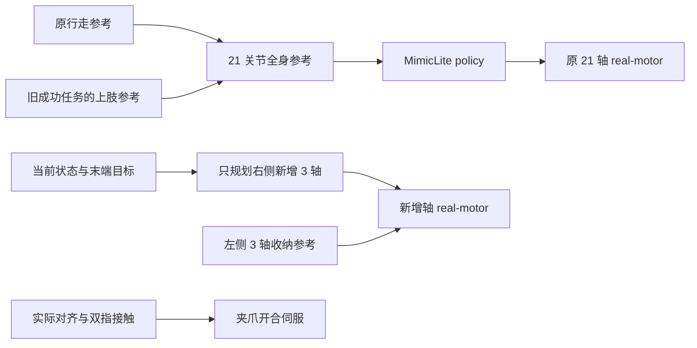

# Mini3：原生关节由 MimicLite 控制的搬运任务

`mini3_pick_carry_policy.py` 是独立的新入口。原机器人全部 **21 个关节**，包括左右肩部和原 `elbow_pitch`，都由已有 Sonic 5200 MimicLite policy 输出控制。只有双侧新增的 **6 个关节**使用独立轨迹控制：右侧根部自转、腕 roll/pitch 使用三关节规划，左侧保持收纳。夹爪开合仍由独立位置伺服控制。

新版本复用旧成功任务的上肢参考动作，在接近方块时就开始抬手，并在接近篮子时提前开始放置动作。原版 `mini3_pick_carry_7dof.py` 保留，完整备份见 [V1 备份说明](../outputs/task_versions/mini3_pick_carry_v1_50mm/BACKUP.md)。

最终版本在无窗口和实际 `mujoco_viewer` 窗口中均用 **26.30 s 仿真时间**完成抓取、携物行走和入篮，比 V1 的 **32.86 s** 缩短 **6.56 s，约 20%**。逐物理步接触记录及保存帧的独立审核均没有异常手臂碰撞。

## 运行与对比

在工程根目录打开轻量 `mujoco_viewer` 窗口：

```bash
cd /home/carrot/Desktop/robot/MimicLite
active-adaptation/venv/mjlab/.venv/bin/python mini3_pick_carry_policy.py --start-paused
```

按 **P** 开始/暂停，**F** 恢复跟随，**F8** 总览、**F9** 头部 RGB、**F10 / F11** 左右夹爪 RGB，**Esc** 退出。鼠标左键拖拽旋转、右键平移、滚轮缩放。窗口沿用 `mini3_task_viewer.py`，保留 MuJoCo 3.11 与 `mujoco_viewer 0.1.4` 的鼠标接口兼容修复；显示使用独立模型和数据，鼠标操作不会向主物理仿真施加扰动。

无窗口复验并保存新目录：

```bash
active-adaptation/venv/mjlab/.venv/bin/python mini3_pick_carry_policy.py \
  --headless --output outputs/mini3_pick_carry_policy_headless
```

运行保留的 V1，使用单独输出以方便比较：

```bash
active-adaptation/venv/mjlab/.venv/bin/python mini3_pick_carry_7dof.py \
  --start-paused --output outputs/mini3_pick_carry_v1_compare
```

| 新版参数 | 含义 |
| --- | --- |
| `--reference` | 旧成功轨迹；默认读取 V1 备份中的 `validated_run/trajectory.npz`，同目录需有 `report.json` |
| `--policy` | 自定义 ONNX 或同名 YAML；默认使用已训练 Sonic 5200 |
| `--motion` | 行走参考动作；默认 `Neutral_walk_forward_005__A057.npz` |
| `--approach-overlap 3.0` | 到达方块前提前 3 s 进入抬手参考过渡 |
| `--basket-overlap 0.6` | 到达篮子前提前 0.6 s 开始放置参考 |
| `--arm-source command` | 默认把旧记录的右臂目标角作为 policy 参考；`actual` 改用旧实测角度 |
| `--arm-reference-bias` | 四个原右臂参考角的偏置，顺序为肩 pitch/roll/yaw、肘 pitch；默认全部为 0，只修改输入参考 |
| `--extra-mode planned` | 默认在线规划右侧新增三轴；`reference` 为直接跟踪新增轴记录的诊断模式 |
| `--gate-timeout 3.0` | 实测抓取、抬起或释放条件持续未满足时的等待上限 |
| `--duration 45` | 最大仿真秒数；超时保存失败原因 |
| `--output` | 默认 `outputs/mini3_pick_carry_policy` |

`--headless` 不能与 `--start-paused` 同时使用。改变参考偏置、场景或交叠时间后，需要重新检查抓取和碰撞结果。

## 控制分工



`mini3_policy_task_reference.py` 从保存的成功任务提取右臂上肢参考与新增轴轨迹，并重建原行走参考。行走部分使用原参考动作，避免把旧运行的身体跟踪误差再次作为目标。右侧原四关节按名称写入全身参考；它们不再由在线四关节或七关节 IK 输出执行目标。

原 21 轴的控制路径为 `policy.step()` → `q / dq / effort / kp / kd` → 原 real-motor 模型。五类输出全部原样传入电机模型；没有用上肢 IK 覆盖关节目标、速度、力矩前馈或增益。电机电流响应、延迟、力矩速度约束和原执行器限幅仍然生效。报告中的 `policy_output_override_max` 和 `policy_output_checks` 用于检查这条接口，轨迹还记录 `policy_command` 与 `motor_command`。

MimicLite 是跟踪策略，仍需要动作参考。当前版本将旧任务已经得到的上肢动作作为条件输入；这不代表网络仅凭 RGB 自主生成了抓取意图，也没有重新训练策略。

新增关节仍为双侧 `elbow_yaw_joint`、`wrist_roll_joint`、`wrist_pitch_joint`。右侧三关节规划以实际状态为起点，兼顾指垫位置、朝向、连续性和碰撞间隙；左侧保持收纳。在线优化器的变量只有右侧新增三关节。它在独立 `MjData` 上进行候选运动学计算，原关节保持实测角度；持物时的候选方块位姿也只用于该副本中的碰撞评估。主仿真没有手臂位置重设、方块位置重设或物体焊接。

最终三关节规划使用位置残差权重 **20**、朝向残差权重 **3.0**、碰撞间隙目标 **8 mm** 及其残差权重 **30**，操作阶段末端目标额外抬高 **5 mm**。朝向约束帮助夹爪保持水平，给桌面和掌部留出间隙。最终运行的四个原右臂参考偏置全部为 **0**，未使用关节校准偏置。

新增轴沿用原 `elbow_pitch` 的 4310P 电机特性，仍带真实电流环及力矩限制，位置环保持 **kp=20、kd=0.4**。新增关节参考每 20 ms 最多变化 0.03 rad，受限积分和偏置力矩前馈仅作用于新增关节。夹爪根据方块在指垫坐标系中的投影半宽计算开口，闭爪及持物时保留每侧 2 mm 的位置预压。

## 减少等待并重叠动作

| 调整 | V1 | 新版默认 |
| --- | --- | --- |
| 到达方块后的显式站立等待 | 2.0 s | 0 s |
| 抬起完成后的显式等待 | 0.5 s | 0 s |
| 到达篮子后的显式等待 | 1.0 s | 0 s |
| 抬手与接近行走交叠 | 无 | 提前 3.0 s 开始参考过渡 |
| 放置与携物行走交叠 | 无 | 提前 0.6 s 开始放置参考 |

`body_source_time` 与 `arm_source_time` 分别推进身体和上肢参考。活动轨迹按原来的 1 倍时间速度播放；缩短的部分来自删除显式等待和让动作同时进行。抬手开始时用 0.5 s 平滑混合从行走上肢姿态接入操作姿态。原活动段内部的短暂收尾不被整体时间压缩。网络实际跟踪速度仍受运动状态和电机动力学影响。

提前抬手阶段先执行让手臂避开髋部和桌腿的路径；不是机器人还远离方块时直接伸爪夹取。抓取与释放继续由实测条件约束：

1. 实际方块包络进入两指可夹取区域且掌部近水平，才开始闭爪。
2. 闭爪至少 1 s，双指接触力均超过 0.1 N，才允许抬起参考继续推进。
3. 方块相对初始位置升高至少 8 cm 且双指保持接触，才允许携物行走；持续丢失接触会中止任务。
4. 方块水平包络位于篮内安全区域且底部高于篮沿，才张开夹爪；落入篮内并稳定后判定成功。

条件未满足时，参考时钟保持在对应阶段，物理仿真和策略仍继续运行。该等待服务于实际抓取状态，与被删除的固定站稳等待不同。

## 场景、感知与碰撞

场景仍为 `any4hdmi/assets/robots/mini3_mjlab/scene_pick_carry_7dof.xml`：初始蓝块前向距离 **3 m**，桌面高 **0.5 m**，双侧新增连杆长 **50 mm**。根部只沿前臂长轴自转，连接处保持笔直；腕 roll/pitch 位于夹爪根部。三个方块、篮子、连杆和夹爪碰撞体保留。

此版本仍直接读取 MuJoCo 的机器人、方块和篮子真实位姿，用于末端规划、闭爪及释放判断。RGB 摄像头仅用于观察，没有目标检测或视觉定位。这是使用特权状态的仿真控制示例。

继承每 2 ms 的双臂实际接触监视，异常穿透超过 2 mm 会立即中止。小于阈值的异常接触也会记录，因此 `success=true` 本身不表示没有碰撞。运行后可以独立审核保存帧：

```bash
active-adaptation/venv/mjlab/.venv/bin/python audit_mini3_arm_collisions.py \
  --trajectory outputs/mini3_pick_carry_policy/trajectory.npz \
  --scene any4hdmi/assets/robots/mini3_mjlab/scene_pick_carry_7dof.xml \
  --output outputs/mini3_pick_carry_policy/arm_collision_audit.json
```

离线审核检查保存帧及模型碰撞几何；逐物理步监视补充帧间实际接触信息。两者均应结合任务结果查看。

## 记录与验证

新版输出 `report.json`、`trajectory.npz`、`task_reference.json` 和 `task_reference.npz`。记录包括 policy 命令、新增关节目标、实际运动、双指接触力、上肢和身体来源时钟、阶段门限等待，以及旧轨迹来源路径和 SHA-256。碰撞审核单独生成。

最终 [轻量窗口报告](../outputs/mini3_pick_carry_policy/report.json) 与 [无窗口报告](../outputs/mini3_policy_v2_horizontal/report.json) 均为 `SUCCESS`，蓝块稳定落入篮内。两次运行各保存 **1315 帧**，全部 **15 个轨迹数组逐元素完全相同**，见 [对比记录](../outputs/mini3_pick_carry_policy/trajectory_comparison_with_headless.json)。

| 最终实测项 | 结果 |
| --- | --- |
| 完整任务仿真时间 | 26.30 s；V1 为 32.86 s |
| 原 21 轴五类 policy 输出的最大覆盖差值 | `policy_output_override_max=0`，检查 13150 次 |
| 每 2 ms 的实际接触监视 | 13150 次，异常接触列表为空 |
| 独立碰撞审核 | 1315 帧 × 345 个几何对，异常碰撞对及被过滤的异常碰撞对均为 0 |
| 抓取、抬起、携物、释放门限的额外等待 | 全部 0 s；原闭爪和抬起动作时长仍保留 |
| 真实电机 / 骨盆支撑 / 物体焊接 | 开启 / 关闭 / 关闭 |

[独立碰撞报告](../outputs/mini3_policy_v2_horizontal/arm_collision_audit.json) 对整个保存轨迹进行审核，最大异常穿透为 0。正常手指—目标方块接触和必要机械连接接口按原规则处理；没有为完成任务修改场景碰撞过滤。

[动作交叠审核](../outputs/mini3_policy_v2_horizontal/overlap_motion_audit.json)显示，**3.48–6.48 s** 接近交叠期间基座前进 **0.965 m**。基座速度超过 0.1 m/s、同时原右臂关节速度向量模长超过 0.1 rad/s 的累计时间为 **1.96 s**。在 **6.44 s**，夹取中心相对基座已抬高 **46.2 mm**，基座仍以 **0.210 m/s** 移动。交叠前半主要向外避让和转臂，竖直抬升集中在接近减速后段；这不是连续 3 s 的纯竖直抬手。

以上结论对应已保存的固定场景复验及所述碰撞审核范围。它们不代表随机场景成功率或基于 RGB 的自主操作。

## 恢复旧源码快照

V1 完整归档位于 `outputs/task_versions/mini3_pick_carry_v1_50mm/source_8839bb9.tar.gz`，对应提交 `8839bb9b35ed88bb605d12245b284bc5e978b78f`。日常比较直接运行保留的 V1 入口即可；如需提取原始源码，应解压到新的空目录：

```bash
mkdir -p outputs/task_versions/mini3_pick_carry_v1_restore
tar -xzf outputs/task_versions/mini3_pick_carry_v1_50mm/source_8839bb9.tar.gz \
  -C outputs/task_versions/mini3_pick_carry_v1_restore
```

解压不会覆盖当前工程。ONNX、checkpoint 的原位置与 hash、所需小型动作和配置、环境信息均见备份说明；归档不复制 Python 虚拟环境和大权重。独立恢复运行时需按记录配置这些外部依赖。
